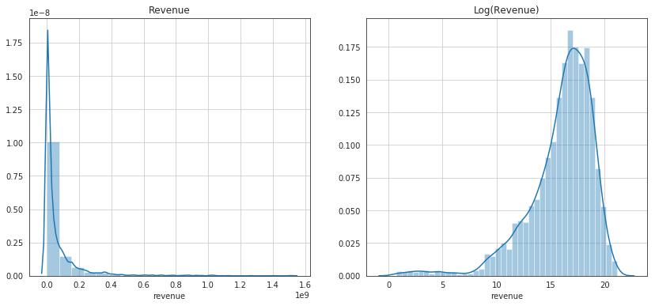
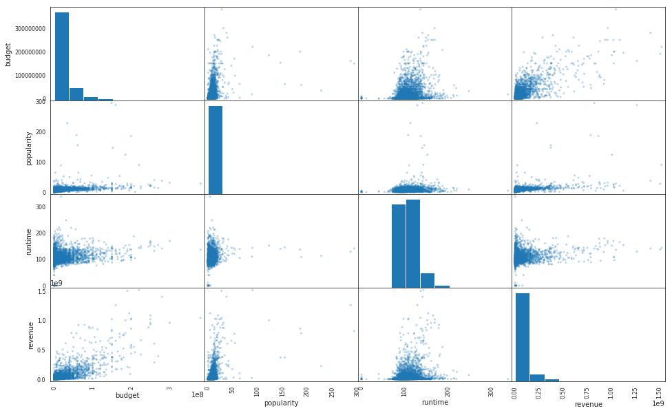
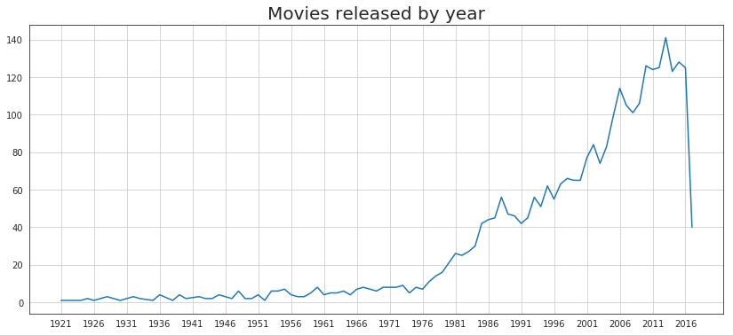
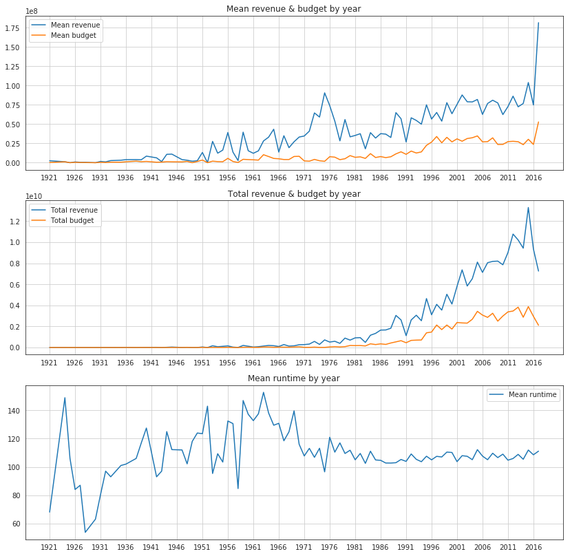
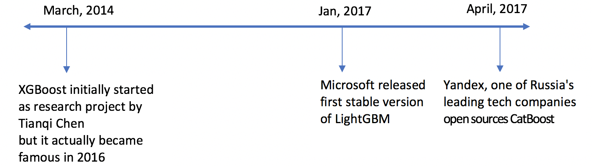

# Machine Learning Engineer Nanodegree
## Capstone Project
## Movie Box Office Revenue Prediction with Stacked Gradient Boosting Models
Daniel Tejeda  
October 1st, 2019

## I. Definition

### Project Overview

Given its economic potential, the movie box office revenue prediction is a problem that is being actively researched by data scientist and production houses. The main goal of this project is to develop a machine learning model that predicts the revenue of a movie with public data that would have been available before the movie is released. I will attempt to determine with exploratory data analysis and techniques, which features of the movie are more relevant for its monetary success. A model that proves to be successful on this task could be of high value for the decision making process of a movie production at different stages or even before the movie gets funding, saving production companies millions of dollars.

The dataset used for this project has been collected from TMDB and published on their [Kaggle competition](https://www.kaggle.com/c/tmdb-box-office-prediction/data). The movie details, credits and keywords have been collected from the TMDB Open API. The dataset contains a range of features such as cast, crew, genre, production company, etc, that will require feature engineering prior modelling.  

### Problem Statement

Forecasting the financial performance of a movie before its release is generally done using some basic statistical techniques described in [[1]](#r1). These approaches are very common in practice but they often provide only a coarse estimate before the movie is released. [[2]](#r2).

I selected three popular gradient boosting models as base: XGBoost, CATBoost and LightGBM. I decided on boosting algorithms because they've been proven to be useful in Kaggle competitions with limited training data, training time and little expertise for parameter tuning [[3]](#r3). I also present a final stacked linear meta-model and its results. This kind of ensemble is also very popular in data science competitions because they can boost predictive accuracy by blending the predictions of multiple models.

### Metrics

Root-mean-squared-logarithmic-error (RMSLE) is the main metric for evaluation of all models in this project. This metric is similar to Root-mean-squared-error (RMSE), only calculated in logarithmic scale. To calculate it we use:

$$\sqrt{\frac{1}{n}\sum_{i=1}^n(\log(y_i+1)-\log(\hat{y}_i+1))^2}$$

The main reason to use this metric instead of RMSE is because of the magnitude of the target variable `revenue`. Since this value can range up to the millions of dollars and we want to get the relative error without considering magnitude, RMSLE is more suited to this scenario. At some points in the code I use the RMSE function since the target variable and predictions are already converted with the logarithm function, which results in RMSLE. 

## II. Analysis

### Data Exploration

The original dataset contains three files:
- **train.csv**. (3000,23) Training data with 3000 records, 22 features and the target variable
- **test.csv**. (4398,22) Testing data with 4398 records and 22 features.
- **sample_submission.csv**. (4398,2) Sample submission file with 4398 records and one column for the target variable. 

The Test dataset does not have the target variable in it because of the nature of Kaggle competitions, so we discarded them and splitted the Train set 80/10/10 for training, validation (10-fold cross validation) and test. 

#### Input Features

- **ID**. Integer unique id of each movie
- **Belongs_to_collection**. Contains the TMDB Id, Name, Movie Poster and Backdrop URL of a movie in JSON format. You can see the Poster and Backdrop Image like this: https://image.tmdb.org/t/p/original/. Example: https://image.tmdb.org/t/p/original//iEhb00TGPucF0b4joM1ieyY026U.jpg
- **Budget**. Budget of a movie in dollars. 0 values mean unknown.
- **Genres**. Contains all the Genres Name & TMDB Id in JSON Format
- **Homepage**. Contains the official homepage URL of a movie. Example: http://sonyclassics.com/whiplash/ , this is the homepage of Whiplash movie.
- **Imdb_id**. IMDB id of a movie (string). You can visit the IMDB Page like this: https://www.imdb.com/title/
- **Original_language**. Two digit code of the original language, in which the movie was made. Like: en = English, fr = french.
- **Original_title**. The original title of a movie. Title & Original title may differ, if the original title is not in English.
- **Overview**. Brief description of the movie.
- **Popularity**. Popularity of the movie in float.
- **Poster_path**. Poster path of a movie. You can see the full image like this: https://image.tmdb.org/t/p/original/
- **Production_companies**. All production company name and TMDB id in JSON format of a movie.
- **Production_countries**. Two digit code and full name of the production company in JSON format.
- **Release_date**. Release date of a movie in mm/dd/yy format.
- **Runtime**. Total runtime of a movie in minutes (Integer).
- **Spoken_languages**. Two digit code and full name of the spoken language.
- **Status**. Is the movie released or rumored?
- **Tagline**. Tagline of a movie
- **Title**. English title of a movie
- **Keywords**. TMDB Id and name of all the keywords in JSON format.
- **Cast**. All cast TMDB id, name, character name, gender (1 = Female, 2 = Male) in JSON format
- **Crew**. Name, TMDB id, profile path of various kind of crew members job like Director, Writer, Art, Sound etc.

#### Target variable

- **Revenue**. Total revenue earned by a movie in dollars.

It was discovered that the original datasets had missing values for `budget` and `revenue`. We found those missing values in one of the [competition's published kernels](https://www.kaggle.com/zero92/tmdb-prediction) and implemented a method to fill them right after we load the data. 

### Exploratory Visualization

### Algorithms and Techniques

Among the machine learning methods used in practice, Gradient Boosting Decision Tree (GBDT) is one technique that shines in  many  applications. Tree boosting has been shown to give state-of-the-art results on many standard classification benchmarks [[6]](#r6)

GBDT is an ensemble model of decision trees, which are trained in sequence [[5]](#5). In each iteration,GBDT learns the decision trees by fitting the negative gradients (also known as residual errors).

There have been quite a few implementations of GBDT in the literature, here I made use of three very popular ones: XGBoost, LightGBM and CatBoost. The following chronological view shows how recent these algorithms were developed and released.

Fig X. XGBoost, LightGBM and CatBoost release timeline. Source: [CatBoost vs. Light GBM vs. XGBoost](https://towardsdatascience.com/catboost-vs-light-gbm-vs-xgboost-5f93620723db)
    
Out of the three models, XGBoost is the only one that cannot handle categorical values[[3]]. Another structural difference between them is how they build the decision trees. In many GBDTs, building next tree comprises two steps: choosing the tree structure and setting values in leafs after the tree structure is fixed. To choose the best tree structure, the algorithm enumerates through different splits, builds trees with these splits, sets values in the obtained leafs, scores the trees and selects the best split.[[7]](#r7). LightGBM uses a novel technique of Gradient-based One-Side Sampling (GOSS) to filter out the data instances for finding a split value while XGBoost uses pre-sorted algorithm & Histogram-based algorithm for computing the best split. In CatBoost the second phase is performed using traditional GBDT scheme and for the first phase uses a modified version.

#### Stacking

Ensemble methods are commonly used to boost predictive accuracy by combining the predictions of
multiple machine learning models. Model stacking is an efficient ensemble method in which the
predictions that are generated by using different learning algorithms are used as inputs in a second-level
learning algorithm. This second-level algorithm is trained to optimally combine the model predictions to
form a final set of predictions [[4]](#r4)

### Benchmark

A K-nearest neighbors (KNN) regressor was used as Stage-1 benchmark. Stage-2 benchmark was chosen from the three boosting algorithms, the one with better results: XGBoost. 

## III. Methodology

### Data Preprocessing

Categorical features have a discrete set of values which are not necessary comparable with each other, making them not suitable to be used in binary decision trees directly. The most widely used technique to approach these, which is usually applied to low-cardinality categorical features is one-hot encoding:  the original feature is removed and a new binary variable is added for each category [7](#7). 

One-hot encoding was done during the preprocessing phase of the data for all models including the benchmark. 

We divided the data preparation steps into methods, they all start with the `data_prep_` prefix. 

#### 1. Clean NA
The first step on the data cleansing was to get rid of the 

#### 2. Release Date decomposition

#### 3. Collection

#### 4. Homepage

#### 5. Genre

#### 6. Cast and Crew

#### 7. Original Language

#### 8. Production Countries and Companies 

### Implementation

### Refinement

## IV. Results

### Model Evaluation and Validation

Results report

- Individual models results
- Benchmark 1 vs GB models
- Benchmark 2 vs Stacked model (with produced features only)
- Benchmark 2 vs Stacked model (with additional features from the source)
- Results with Kaggle test set

### Justification

## V. Conclusion

### Free-Form Visualization

### Reflection

### Improvement

### References

<a name=r1>[1]</a> Simonoff, J. S. and Sparrow, I. R. Predicting movie grosses: Winners and losers, blockbusters and sleepers. In Chance, 2000

<a name=r2>[2]<a> Matt Vitelli. [Predicting Box Office Revenue for Movies](http://snap.stanford.edu/class/cs224w-2015/projects_2015/Predicting_Box_Office_Revenue_for_Movies.pdf)
    
<a name=r3>[3]<a> Alvira Swalin, [CatBoost vs. Light GBM vs. XGBoost](https://towardsdatascience.com/catboost-vs-light-gbm-vs-xgboost-5f93620723db)

<a name=r4>[4]<a> Sill, J., Takacs, G., Mackey, L., and Lin, D. 2009. [Feature-Weighted Linear Stacking](https://arxiv.org/pdf/0911.0460.pdf)
    
<a name=r5>[5]<a> Jerome H Friedman. [Greedy function approximation: a gradient boosting machine](https://statweb.stanford.edu/~jhf/ftp/trebst.pdf). 2001
    
<a name=r6>[6]<a> Tianqi Chen and Carlos Guestrin. [XGBoost: A Scalable Tree Boosting System](https://arxiv.org/pdf/1603.02754.pdf)

<a name=r7>[7]<a> D. Micci-Barreca. [A preprocessing scheme for high-cardinality categorical attributes in classification and prediction problems](http://helios.mm.di.uoa.gr/~rouvas/ssi/sigkdd/sigkdd.vol3.1/barreca.pdf). 2001
    
<a name=r8>[8]<a> Anna Veronika Dorogush, Vasily Ershov and Andrey Gulin. [CatBoost: gradient boosting with categorical featuressupport](http://learningsys.org/nips17/assets/papers/paper_11.pdf)
    
    
    
<a name=r4>[4]<a> Guolin Ke, Qi Meng, Thomas Finley, Taifeng Wang, Wei Chen, Weidong Ma, Qiwei Ye and Tie-Yan Liu. [LightGBM: A Highly Efficient Gradient Boosting Decision Tree](https://papers.nips.cc/paper/6907-lightgbm-a-highly-efficient-gradient-boosting-decision-tree.pdf)

<a name=r4>[4]<a> Anna Veronika Dorogush, Vasily Ershov and Andrey Gulin. [CatBoost: gradient boosting with categorical featuressupport](http://learningsys.org/nips17/assets/papers/paper_11.pdf)

