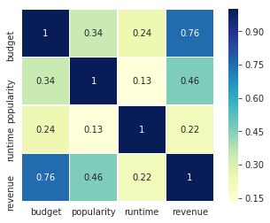
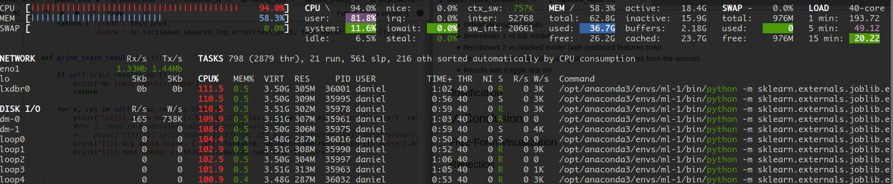

# Machine Learning Engineer Nanodegree
## Capstone Project
## Movie Box Office Revenue Prediction with Stacked Gradient Boosting Models
Daniel Tejeda  
October 1st, 2019

## I. Definition

### Project Overview

Given its economic potential, the movie box office revenue prediction is a problem that is being actively researched by data scientist and production houses. The main goal of this project is to develop a machine learning model that predicts the revenue of a movie with public data that would have been available before the movie is released. I will attempt to determine with exploratory data analysis and techniques, which features of the movie are more relevant for its monetary success. A model that proves to be successful on this task could be of high value for the decision making process of a movie production at different stages or even before the movie gets funding, saving production companies millions of dollars.

The dataset used for this project has been collected from TMDB and published on their [Kaggle competition](https://www.kaggle.com/c/tmdb-box-office-prediction/data). The movie details, credits and keywords have been collected from the TMDB Open API. The dataset contains a range of features such as cast, crew, genre, production company, etc, that will require feature engineering prior modelling.  

### Problem Statement

Forecasting the financial performance of a movie before its release is generally done using some basic statistical techniques described in [[1]](#r1). These approaches are very common in practice but they often provide only a coarse estimate before the movie is released. [[2]](#r2).

I selected three popular gradient boosting models as base: XGBoost, CATBoost and LightGBM. I decided on boosting algorithms because they've been proven to be useful in Kaggle competitions with limited training data, training time and little expertise for parameter tuning [[3]](#r3). I also present a final stacked linear meta-model and its results. This kind of ensemble is also very popular in data science competitions because they can boost predictive accuracy by blending the predictions of multiple models.


### Metrics

Root-mean-squared-logarithmic-error (RMSLE) is the main metric for evaluation of all models in this project. This metric is similar to Root-mean-squared-error (RMSE), only calculated in logarithmic scale. To calculate it we use:

$$\sqrt{\frac{1}{n}\sum_{i=1}^n(\log(y_i+1)-\log(\hat{y}_i+1))^2}$$

The main reason to use this metric instead of RMSE is because of the magnitude of the target variable `revenue`. Since this value can range up to the millions of dollars and we want to get the relative error without considering magnitude, RMSLE is more suited to this scenario. At some points in the code I use the RMSE function since the target variable and predictions are already converted with the logarithm function, which results in RMSLE. 


## II. Analysis

### Data Exploration

The original dataset contains three files:
- **train.csv**. (3000,23) Training data with 3000 records, 22 features and the target variable
- **test.csv**. (4398,22) Testing data with 4398 records and 22 features.
- **sample_submission.csv**. (4398,2) Sample submission file with 4398 records and one column for the target variable. 

The Test dataset does not have the target variable in it because of the nature of Kaggle competitions, so we discarded them and splitted the Train set 80/10/10 for training, validation (10-fold cross validation) and test. 


#### Input Features

- **ID**. Integer unique id of each movie
- **Belongs_to_collection**. Contains the TMDB Id, Name, Movie Poster and Backdrop URL of a movie in JSON format. You can see the Poster and Backdrop Image like this: https://image.tmdb.org/t/p/original/. Example: https://image.tmdb.org/t/p/original//iEhb00TGPucF0b4joM1ieyY026U.jpg
- **Budget**. Budget of a movie in dollars. 0 values mean unknown.
- **Genres**. Contains all the Genres Name & TMDB Id in JSON Format
- **Homepage**. Contains the official homepage URL of a movie. Example: http://sonyclassics.com/whiplash/ , this is the homepage of Whiplash movie.
- **Imdb_id**. IMDB id of a movie (string). You can visit the IMDB Page like this: https://www.imdb.com/title/
- **Original_language**. Two digit code of the original language, in which the movie was made. Like: en = English, fr = french.
- **Original_title**. The original title of a movie. Title & Original title may differ, if the original title is not in English.
- **Overview**. Brief description of the movie.
- **Popularity**. Popularity of the movie in float.
- **Poster_path**. Poster path of a movie. You can see the full image like this: https://image.tmdb.org/t/p/original/
- **Production_companies**. All production company name and TMDB id in JSON format of a movie.
- **Production_countries**. Two digit code and full name of the production company in JSON format.
- **Release_date**. Release date of a movie in mm/dd/yy format.
- **Runtime**. Total runtime of a movie in minutes (Integer).
- **Spoken_languages**. Two digit code and full name of the spoken language.
- **Status**. Is the movie released or rumored?
- **Tagline**. Tagline of a movie
- **Title**. English title of a movie
- **Keywords**. TMDB Id and name of all the keywords in JSON format.
- **Cast**. All cast TMDB id, name, character name, gender (1 = Female, 2 = Male) in JSON format
- **Crew**. Name, TMDB id, profile path of various kind of crew members job like Director, Writer, Art, Sound etc.

#### Target variable

- **Revenue**. Total revenue earned by a movie in dollars.


It was discovered that the original datasets had missing values for `budget` and `revenue`. We found those missing values in one of the [competition's published kernels](https://www.kaggle.com/zero92/tmdb-prediction) and implemented a method to fill them right after we load the data. 

After filling the missing values for `budget` and `revenue`, we still have missing values to address in data pre-processing.


<table border="1" class="dataframe">
  <thead>
    <tr>
      <th></th>
      <th>empty</th>
    </tr>
  </thead>
  <tbody>
    <tr>
      <th></th>
      <td></td>
    </tr>
    <tr>
      <td>belongs_to_collection</td>
      <td>2396</td>
    </tr>
    <tr>
      <td>budget</td>
      <td>0</td>
    </tr>
    <tr>
      <td>genres</td>
      <td>7</td>
    </tr>
    <tr>
      <td>homepage</td>
      <td>2054</td>
    </tr>
    <tr>
      <td>imdb_id</td>
      <td>0</td>
    </tr>
    <tr>
      <td>original_language</td>
      <td>0</td>
    </tr>
    <tr>
      <td>original_title</td>
      <td>0</td>
    </tr>
    <tr>
      <td>overview</td>
      <td>8</td>
    </tr>
    <tr>
      <td>popularity</td>
      <td>0</td>
    </tr>
    <tr>
      <td>poster_path</td>
      <td>1</td>
    </tr>
    <tr>
      <td>production_companies</td>
      <td>156</td>
    </tr>
    <tr>
      <td>production_countries</td>
      <td>55</td>
    </tr>
    <tr>
      <td>release_date</td>
      <td>0</td>
    </tr>
    <tr>
      <td>runtime</td>
      <td>2</td>
    </tr>
    <tr>
      <td>spoken_languages</td>
      <td>20</td>
    </tr>
    <tr>
      <td>status</td>
      <td>0</td>
    </tr>
    <tr>
      <td>tagline</td>
      <td>597</td>
    </tr>
    <tr>
      <td>title</td>
      <td>0</td>
    </tr>
    <tr>
      <td>Keywords</td>
      <td>276</td>
    </tr>
    <tr>
      <td>cast</td>
      <td>13</td>
    </tr>
    <tr>
      <td>crew</td>
      <td>16</td>
    </tr>
    <tr>
      <td>revenue</td>
      <td>0</td>
    </tr>
  </tbody>
</table>


Out of curiosity, I wanted to know which movies were the top 10 of this dataset:


<table border="1" class="dataframe">
  <thead>
    <tr>
      <th></th>
      <th>title</th>
      <th>revenue</th>
      <th>release_date</th>
    </tr>
  </thead>
  <tbody>
    <tr>
      <th>1126</th>
      <td>The Avengers</td>
      <td>1519557910</td>
      <td>4/25/12</td>
    </tr>
    <tr>
      <th>1761</th>
      <td>Furious 7</td>
      <td>1506249360</td>
      <td>4/1/15</td>
    </tr>
    <tr>
      <th>2770</th>
      <td>Avengers: Age of Ultron</td>
      <td>1405403694</td>
      <td>4/22/15</td>
    </tr>
    <tr>
      <th>684</th>
      <td>Beauty and the Beast</td>
      <td>1262886337</td>
      <td>3/16/17</td>
    </tr>
    <tr>
      <th>2322</th>
      <td>Transformers: Dark of the Moon</td>
      <td>1123746996</td>
      <td>6/28/11</td>
    </tr>
    <tr>
      <th>906</th>
      <td>The Dark Knight Rises</td>
      <td>1084939099</td>
      <td>7/16/12</td>
    </tr>
    <tr>
      <th>2135</th>
      <td>Pirates of the Caribbean: On Stranger Tides</td>
      <td>1045713802</td>
      <td>5/14/11</td>
    </tr>
    <tr>
      <th>2562</th>
      <td>Finding Dory</td>
      <td>1028570889</td>
      <td>6/16/16</td>
    </tr>
    <tr>
      <th>881</th>
      <td>Alice in Wonderland</td>
      <td>1025491110</td>
      <td>3/3/10</td>
    </tr>
    <tr>
      <th>734</th>
      <td>Zootopia</td>
      <td>1023784195</td>
      <td>2/11/16</td>
    </tr>
    
  </tbody>
</table>


### Exploratory Visualization

My first step was to look at the distribution of the target variable `revenue`. The following figure (left) shows that the distribution is quite skewed. I used log transformation to deal with this, as shown on the right plot.


My next step was to review the correlation of the three quantitative features and the target variable `revenue`. This is shown in the following scatter matrix.


Makes sense that budget is the feature that shows more correlation with revenue. Another visualization in the following heatmap.
<center></center>
<center>Correlation between quantitative variables</center><p/>

I also wanted to get a sense of how the dataset was distributed throughout the years. The following figure shows the movies released per year. It clearly shows that from 1921-1976 the amount of data is consistently low and starts to get better in the 90's. The year with the highest number of released movies is 2013 with 141 movies in the dataset.


Some more visualizations of Revenue vs Budget. Mean and total revenue per year and finally the mean runtime by year. 


After all these plots were produced, I concluded that `runtime` seems to be the less correlated variable among the quantiative features to `budget`.

### Algorithms and Techniques

Among the machine learning methods used in practice, Gradient Boosting Decision Tree (GBDT) is one technique that shines in  many  applications. Tree boosting has been shown to give state-of-the-art results on many standard classification benchmarks [[6]](#r6)

GBDT is an ensemble model of decision trees, which are trained in sequence [[5]](#5). In each iteration,GBDT learns the decision trees by fitting the negative gradients (also known as residual errors).

There have been quite a few implementations of GBDT in the literature, here I made use of three very popular ones: XGBoost, LightGBM and CatBoost. The following chronological view shows how recent these algorithms were developed and released.


<center>
Fig X. XGBoost, LightGBM and CatBoost release timeline. Source: <a href="https://towardsdatascience.com/catboost-vs-light-gbm-vs-xgboost-5f93620723db">CatBoost vs. Light GBM vs. XGBoost</a>
</center><p/>

Out of the three models, XGBoost is the only one that cannot handle categorical values[[3]]. Another structural difference between them is how they build the decision trees. In many GBDTs, building next tree comprises two steps: choosing the tree structure and setting values in leafs after the tree structure is fixed. To choose the best tree structure, the algorithm enumerates through different splits, builds trees with these splits, sets values in the obtained leafs, scores the trees and selects the best split.[[7]](#r7). LightGBM uses a novel technique of Gradient-based One-Side Sampling (GOSS) to filter out the data instances for finding a split value while XGBoost uses pre-sorted algorithm & Histogram-based algorithm for computing the best split. In CatBoost the second phase is performed using traditional GBDT scheme and for the first phase uses a modified version.

#### K-fold validation

I am using 10-fold cross validation for training and validation. This will split the dataset into 10 parts, train on 9 and validate on 1 and repeat for all combinations of train-validation splits.

#### Stacking

Ensemble methods are commonly used to boost predictive accuracy by combining the predictions of
multiple machine learning models. Model stacking is an efficient ensemble method in which the
predictions that are generated by using different learning algorithms are used as inputs in a second-level learning algorithm. This second-level algorithm is trained to optimally combine the model predictions to form a final set of predictions [[4]](#r4).


### Benchmark

A K-nearest neighbors (KNN) regressor was used as Stage-1 benchmark. Stage-2 benchmark was chosen from the "vanilla" three boosting algorithms, the one with better results: CatBoost. 


## III. Methodology

### Data Preprocessing

Categorical features have a discrete set of values which are not necessary comparable with each other, making them not suitable to be used in binary decision trees directly. The most widely used technique to approach these, which is usually applied to low-cardinality categorical features is one-hot encoding:  the original feature is removed and a new binary variable is added for each category [7](#7). One-hot encoding was done during the preprocessing phase of the data for all models including the benchmark.
Another scenario that I found was List/JSON format for some columns. For these, I first extracted the information from the list of JSON objects and then reformatted them. 

I created a general method for data preprocessing and divided it into steps methods as follows:

```python
def prepare_data(in_data):
    
    #copy
    data = in_data.set_index('id')
    
    data_prep_clean_na(data) # 1. Clean NA
    data_prep_dates(data) # 2. Release Date decomposition
    data_prep_collection(data) # 3. Collection
    data_prep_homepage(data) # 4. Homepage
    data_prep_genres(data) # 5. Genre
    data_prep_cast_crew(data) # 6. Cast and Crew
    data_prep_lang(data) # 7. Original Language
    data_prep_prod_companies_countries(data) # 8. Production Countries and Companies 
    data_prep_final(data) # 9. Final cleanup and logarithmic conversion of quantities
    
    return data
    
```

- 1. **Clean NA.** The first step on the data cleansing was to get rid of the missing values. The only quantitative variable with missing values was `runtime` so I replaced the NA with the mean (only two missing values). I filled all other fields with a blank string.

- 2. **Release Date decomposition.** The date is in string format with mm/dd/yy. I broke it down into five different features: Day, Month, Year, Dow (day of week), and Quarter. I also completed the year field to be the full 4-digit year.

- 3. **Collection.** This field contained the informarmation about the collection in JSON format. I decomposed it into one boolean field (0,1) to indicate if the movie belongs to a collection and did one-hot encoding for the ones that belong to a collection with 3 or more movies. Total columns added: 34.

- 4. **Homepage.** I created a boolean field to indicate if the movie has homepage or not, 946 out of  3000 have homepage.

- 5. **Genre.** Since one movie can belong to more than one gender, I first extracted the JSON information and put this into another column `genre_new` with the genre names separated by a pipe. I then did one-hot encoding of the values, adding 20 columns to the dataset.

- 6. **Cast and Crew.** These two field were decomposed into eight fields based on the gender of people and total count of cast and crew members, i.e. cast_g1 is the total count of all female members of the cast. 1=female, 2=male and 0 is not specified. 

- 7. **Original Language.** Simple full one-hot encoding, 36 columns added.

- 8. **Production Countries and Companies.** These two columns had the same cardinality as Genre, meaning one movie could be produced by more than one company in more than one country. I applied the same approach of extracting the JSON names for both, put them in a separate column as strings separated by pipes and then one-hot encoded them. This process added too many columns at first so I put a minimum count of 15 for companies and 5 for countries. The result was 48 columns added for companies and 39 for countries. 

- 9. **Final cleanup and logarithmic conversion of quantities.** In this final method I convert the quantitative input features (`budget`, `runtime` and `popularity`) with logarithm and get rid of the original and temporary features created during data preprocessing. 


### Implementation

The model implementation is in class `MovieRevenuePredictor`. This class contains the benchmark, all three GBDT models and the meta-model along with data and methods for training, validating and testing. 


#### Initialization

The class constructor has the following parameters:
- **data**. full dataset
- **random_seed=1.** random seed to be used across all methods to get reproducible results
- **splits=10.** number of training/validation data folds, default 10
- **test_size=0.1.** test size, default 10%
- **gridsearch=False.** added to get the best models through Grid Search. Defaul is `False` which means 'vanilla' models are used. 

As meantioned, the original Test dataset is not usable because it has no labels. I do the splitting of the dataset into Train-Validation and Test in the method `prepare_data` of the class.

```python
    def prepare_data(self, dataset, splits, test_size):
        
        train, test,  = train_test_split(dataset, test_size=test_size, random_state=self.random_seed)
        
        self.data = {
            'raw': dataset, 
            'train': train,
            'test' : test
        }
        
        kfold = KFold(splits, shuffle = True, random_state = self.random_seed)
        
        self.fold = list(kfold.split(self.data['train'].values))
        
```

I also create the test-validation splits here and save it into the classs attribute `fold` to be used later on training and meta-feature generation.

After data is ready, we create the base 'vanilla' models. If the parameter `gridsearch` is set to True, we do a Grid Search on the base models (XGBoost, LightGBM and CatBoost) to find the best parameters. 

#### Training, training and predicting with base models 

You can train the base models (and the benchmark) with the `train` method. You have a number of parameters to pass, the more relevant ones are `models` for passing a list of model names (default is all the base models) and `stacking` which controls whether stacking needs to be prepared. If set to True, meta-features are generated for each of the validation folds when training the base models and the meta-model is also trained at the end. 

For testing and prediction I created methods:
- **Test** can take an additional dataset or do testing on the default one if nothing is specified. 
- **Predict** uses the base models to make predictions. 

#### Stacking implementation

I used the train-validation splits to produce the meta-features in a new dataset called `train_meta` in the following way: 
1. For each base model I created a new meta-feature (column) in the `train_meta` dataset, 
2. I made predictions on the test fold only, with the base model trained on the other 9 folds
3. I continued to fill the missing values for each of the validation folds until the meta-feature was complete. 

It’s important to note that the meta-features in row `i` of `train_meta` are not dependent on the target value in row `i` because they were produced using information that excluded the `target_i` in the base models’ fitting procedure.

Similarly to the base models, I created the methods `train_meta`, `test_meta` and `predict_meta` with the same idea behind them. 

### Refinement

I originally started using the default hyperparameters for the base models. They provided very good initial scores but after I had the overall structure I created the `find_best_params` method to have a grid search and results improved. This was a resource intensive task that used almost all 40 cpus in my server. 



The resulting best models: 


    {'xgb': XGBRegressor(base_score=0.5, booster='gbtree', colsample_bylevel=1,
            colsample_bynode=1, colsample_bytree=1, eval_metric='rmse', gamma=0,
            importance_type='gain', learning_rate=0.05, max_delta_step=0,
            max_depth=30, min_child_weight=6, missing=None, n_estimators=200,
            n_jobs=1, nthread=None, objective='reg:linear', random_state=0,
            reg_alpha=0, reg_lambda=1, scale_pos_weight=1, seed=681,
            silent=True, subsample=1, verbosity=1),
     'lgb': LGBMRegressor(bagging_seed=681, boosting_type='gbdt', class_weight=None,
            colsample_bytree=1.0, importance_type='split', learning_rate=0.05,
            max_depth=50, metric='rmse', min_child_samples=20,
            min_child_weight=0.001, min_split_gain=0.0, n_estimators=200,
            n_jobs=-1, num_leaves=300, objective='regression',
            random_state=None, reg_alpha=0.0, reg_lambda=0.0, silent=True,
            subsample=1.0, subsample_for_bin=200000, subsample_freq=0,
            use_best_model=True),
     'cat': <catboost.core.CatBoostRegressor at 0x7f6a188a0908>}


```python
movie_pred.best_models['cat'].get_params()
```

    {'eval_metric': 'RMSE',
     'verbose': False,
     'random_seed': 681,
     'loss_function': 'RMSE',
     'depth': 4,
     'iterations': 300,
     'l2_leaf_reg': 4,
     'learning_rate': 0.1}


The initial stacking approach (and a very popular one in Kaggle) was to apply fixed weights to the results of the base models. I searched for a better approach and found the one[[9]](#r9) I finally use that involves the a linear regression meta-model with the meta-features produced by the base models. 


## IV. Results


### Model Evaluation and Validation

Results report

- Individual models results
- Benchmark 1 vs GB models
- Benchmark 2 vs Stacked model (with produced features only)
- Benchmark 2 vs Stacked model (with additional features from the source)
- Results with Kaggle test set


### Justification


## V. Conclusion


### Free-Form Visualization


### Reflection


### Improvement


### References


<a name=r1>[1]</a> Simonoff, J. S. and Sparrow, I. R. Predicting movie grosses: Winners and losers, blockbusters and sleepers. In Chance, 2000

<a name=r2>[2]<a> Matt Vitelli. [Predicting Box Office Revenue for Movies](http://snap.stanford.edu/class/cs224w-2015/projects_2015/Predicting_Box_Office_Revenue_for_Movies.pdf)
    
<a name=r3>[3]<a> Alvira Swalin, [CatBoost vs. Light GBM vs. XGBoost](https://towardsdatascience.com/catboost-vs-light-gbm-vs-xgboost-5f93620723db)

<a name=r4>[4]<a> Sill, J., Takacs, G., Mackey, L., and Lin, D. 2009. [Feature-Weighted Linear Stacking](https://arxiv.org/pdf/0911.0460.pdf)
    
<a name=r5>[5]<a> Jerome H Friedman. [Greedy function approximation: a gradient boosting machine](https://statweb.stanford.edu/~jhf/ftp/trebst.pdf). 2001
    
<a name=r6>[6]<a> Tianqi Chen and Carlos Guestrin. [XGBoost: A Scalable Tree Boosting System](https://arxiv.org/pdf/1603.02754.pdf)

<a name=r7>[7]<a> D. Micci-Barreca. [A preprocessing scheme for high-cardinality categorical attributes in classification and prediction problems](http://helios.mm.di.uoa.gr/~rouvas/ssi/sigkdd/sigkdd.vol3.1/barreca.pdf). 2001
    
<a name=r8>[8]<a> Anna Veronika Dorogush, Vasily Ershov and Andrey Gulin. [CatBoost: gradient boosting with categorical featuressupport](http://learningsys.org/nips17/assets/papers/paper_11.pdf)
    
<a name=r9>[9]<a> Ben Gorman. [A Kaggler's Guide to Model Stacking in Practice](http://blog.kaggle.com/2016/12/27/a-kagglers-guide-to-model-stacking-in-practice/) 2016

    
<a name=r4>[4]<a> Guolin Ke, Qi Meng, Thomas Finley, Taifeng Wang, Wei Chen, Weidong Ma, Qiwei Ye and Tie-Yan Liu. [LightGBM: A Highly Efficient Gradient Boosting Decision Tree](https://papers.nips.cc/paper/6907-lightgbm-a-highly-efficient-gradient-boosting-decision-tree.pdf)

<a name=r4>[4]<a> Anna Veronika Dorogush, Vasily Ershov and Andrey Gulin. [CatBoost: gradient boosting with categorical featuressupport](http://learningsys.org/nips17/assets/papers/paper_11.pdf)

