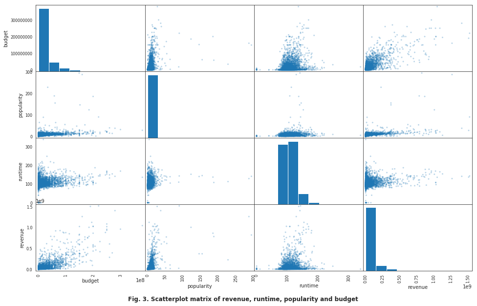
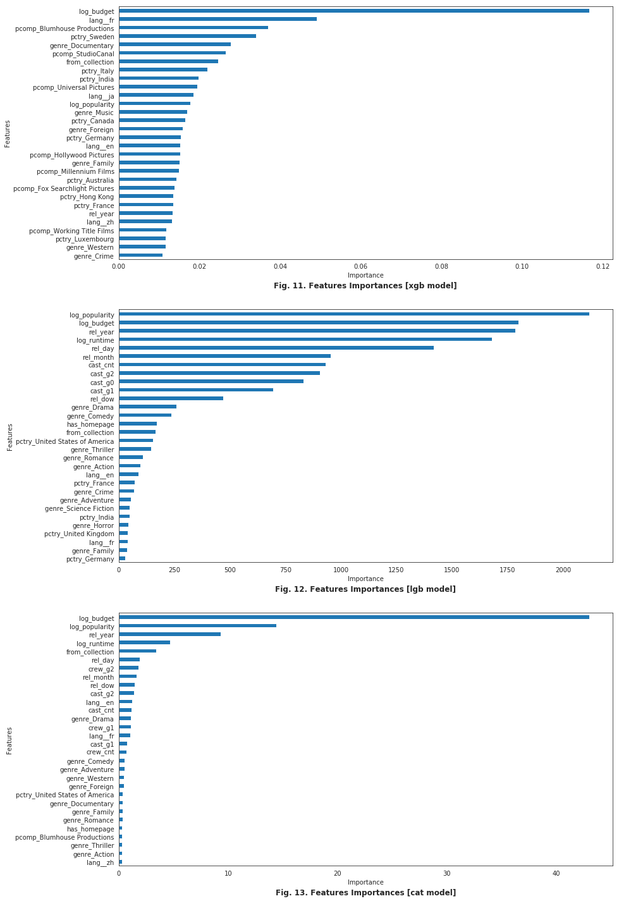

# Machine Learning Engineer Nanodegree - 2019
## Capstone Project: Movie Box Office Revenue Prediction with Gradient Boosting Models
Author: Daniel Tejeda

In a world where movies made an estimated 41.7 billion in 2018 and expected to go over 50 billion by 2020, the film industry is more popular than ever. But which movies make the most money at the box office? How much does a director or the budget matter? In this capstone project, I will build a model to answer that question, working with metadata on over 7,000 past films from The Movie Database published as part of TMDB Box Office Prediction Kaggle competition. 


### Project Design

This project will be implemented in Python 3.7. Libraries involved will be numpy, pandas, matplotlib, seaborn, xgboost, lightgbm, catboost, scikit-learn.

The workflow for this project will be in the following order: 
0. Import all libraries
- Exploratory data analysis
- Data cleansing and Feature engineering
- Train the KNN benchmark model based on budget, popularity and runtime
- Stage-1: Boosting Models 
    * Code and train XGBoost model 
    * Code and train CATBoost model
    * Code and train LightGBM model
    * Hyperparameter tuning for the three models
    * Evaluate results against KNN and select new benchmark from the boosting models to be the new benchmark.
    
- Stage 2: Stacked final model
    * Select stacking approach and regression algorithm for the final model
    * Train regression algorithm with the outputs of the base boosting models combined with the original features, according to the stacking approach
    * Hyperparameter tuning for the final model
    * Evaluate and report final results against the benchmark 


## 0. Import all libraries


```python
%load_ext autoreload
%autoreload 2

import pandas as pd
import numpy as np
import seaborn as sb
import matplotlib.pyplot as plt

import data_prep as dp
import json
from itertools import cycle, islice
from datetime import datetime

from sklearn.metrics import mean_squared_log_error, mean_squared_error
from sklearn.model_selection import train_test_split, GridSearchCV
from sklearn.neighbors import KNeighborsRegressor
from sklearn.linear_model import LogisticRegression, SGDRegressor, LinearRegression
from sklearn.preprocessing import StandardScaler, MinMaxScaler
from sklearn.model_selection import KFold
from sklearn import cluster

import xgboost as xgb
import lightgbm as lgb
import catboost as cat
import copy
import itertools

```

## 1. Exploratory data analysis


```python
dataset_names = ['train','test']

# load original datasets
original_datasets = { ds : pd.read_csv("data/{}.csv".format(ds)) for ds in dataset_names }

# complete missing budget/revenue values from B H's Kernel. (https://www.kaggle.com/zero92/tmdb-prediction)
dp.complete_missing_data(original_datasets)

original_datasets['train'].head(3)
```


<div>
<style scoped>
    .dataframe tbody tr th:only-of-type {
        vertical-align: middle;
    }

    .dataframe tbody tr th {
        vertical-align: top;
    }

    .dataframe thead th {
        text-align: right;
    }
</style>
<table border="1" class="dataframe">
  <thead>
    <tr style="text-align: right;">
      <th></th>
      <th>id</th>
      <th>belongs_to_collection</th>
      <th>budget</th>
      <th>genres</th>
      <th>homepage</th>
      <th>imdb_id</th>
      <th>original_language</th>
      <th>original_title</th>
      <th>overview</th>
      <th>popularity</th>
      <th>...</th>
      <th>release_date</th>
      <th>runtime</th>
      <th>spoken_languages</th>
      <th>status</th>
      <th>tagline</th>
      <th>title</th>
      <th>Keywords</th>
      <th>cast</th>
      <th>crew</th>
      <th>revenue</th>
    </tr>
  </thead>
  <tbody>
    <tr>
      <th>0</th>
      <td>1</td>
      <td>[{'id': 313576, 'name': 'Hot Tub Time Machine ...</td>
      <td>14000000</td>
      <td>[{'id': 35, 'name': 'Comedy'}]</td>
      <td>NaN</td>
      <td>tt2637294</td>
      <td>en</td>
      <td>Hot Tub Time Machine 2</td>
      <td>When Lou, who has become the "father of the In...</td>
      <td>6.575393</td>
      <td>...</td>
      <td>2/20/15</td>
      <td>93.0</td>
      <td>[{'iso_639_1': 'en', 'name': 'English'}]</td>
      <td>Released</td>
      <td>The Laws of Space and Time are About to be Vio...</td>
      <td>Hot Tub Time Machine 2</td>
      <td>[{'id': 4379, 'name': 'time travel'}, {'id': 9...</td>
      <td>[{'cast_id': 4, 'character': 'Lou', 'credit_id...</td>
      <td>[{'credit_id': '59ac067c92514107af02c8c8', 'de...</td>
      <td>12314651</td>
    </tr>
    <tr>
      <th>1</th>
      <td>2</td>
      <td>[{'id': 107674, 'name': 'The Princess Diaries ...</td>
      <td>40000000</td>
      <td>[{'id': 35, 'name': 'Comedy'}, {'id': 18, 'nam...</td>
      <td>NaN</td>
      <td>tt0368933</td>
      <td>en</td>
      <td>The Princess Diaries 2: Royal Engagement</td>
      <td>Mia Thermopolis is now a college graduate and ...</td>
      <td>8.248895</td>
      <td>...</td>
      <td>8/6/04</td>
      <td>113.0</td>
      <td>[{'iso_639_1': 'en', 'name': 'English'}]</td>
      <td>Released</td>
      <td>It can take a lifetime to find true love; she'...</td>
      <td>The Princess Diaries 2: Royal Engagement</td>
      <td>[{'id': 2505, 'name': 'coronation'}, {'id': 42...</td>
      <td>[{'cast_id': 1, 'character': 'Mia Thermopolis'...</td>
      <td>[{'credit_id': '52fe43fe9251416c7502563d', 'de...</td>
      <td>95149435</td>
    </tr>
    <tr>
      <th>2</th>
      <td>3</td>
      <td>NaN</td>
      <td>3300000</td>
      <td>[{'id': 18, 'name': 'Drama'}]</td>
      <td>http://sonyclassics.com/whiplash/</td>
      <td>tt2582802</td>
      <td>en</td>
      <td>Whiplash</td>
      <td>Under the direction of a ruthless instructor, ...</td>
      <td>64.299990</td>
      <td>...</td>
      <td>10/10/14</td>
      <td>105.0</td>
      <td>[{'iso_639_1': 'en', 'name': 'English'}]</td>
      <td>Released</td>
      <td>The road to greatness can take you to the edge.</td>
      <td>Whiplash</td>
      <td>[{'id': 1416, 'name': 'jazz'}, {'id': 1523, 'n...</td>
      <td>[{'cast_id': 5, 'character': 'Andrew Neimann',...</td>
      <td>[{'credit_id': '54d5356ec3a3683ba0000039', 'de...</td>
      <td>13092000</td>
    </tr>
  </tbody>
</table>
<p>3 rows × 23 columns</p>
</div>


```python
n_records = original_datasets['train'].shape[0]
n_columns = original_datasets['train'].shape[1]

print("Total number of records: {}".format(n_records))
print("Total number of features: {}".format(n_columns))
```

    Total number of records: 3000
    Total number of features: 23


```python
original_datasets['train'].describe(include='all')
```


<div>
<style scoped>
    .dataframe tbody tr th:only-of-type {
        vertical-align: middle;
    }

    .dataframe tbody tr th {
        vertical-align: top;
    }

    .dataframe thead th {
        text-align: right;
    }
</style>
<table border="1" class="dataframe">
  <thead>
    <tr style="text-align: right;">
      <th></th>
      <th>id</th>
      <th>belongs_to_collection</th>
      <th>budget</th>
      <th>genres</th>
      <th>homepage</th>
      <th>imdb_id</th>
      <th>original_language</th>
      <th>original_title</th>
      <th>overview</th>
      <th>popularity</th>
      <th>...</th>
      <th>release_date</th>
      <th>runtime</th>
      <th>spoken_languages</th>
      <th>status</th>
      <th>tagline</th>
      <th>title</th>
      <th>Keywords</th>
      <th>cast</th>
      <th>crew</th>
      <th>revenue</th>
    </tr>
  </thead>
  <tbody>
    <tr>
      <th>count</th>
      <td>3000.000000</td>
      <td>604</td>
      <td>3.000000e+03</td>
      <td>2993</td>
      <td>946</td>
      <td>3000</td>
      <td>3000</td>
      <td>3000</td>
      <td>2992</td>
      <td>3000.000000</td>
      <td>...</td>
      <td>3000</td>
      <td>2998.000000</td>
      <td>2980</td>
      <td>3000</td>
      <td>2403</td>
      <td>3000</td>
      <td>2724</td>
      <td>2987</td>
      <td>2984</td>
      <td>3.000000e+03</td>
    </tr>
    <tr>
      <th>unique</th>
      <td>NaN</td>
      <td>422</td>
      <td>NaN</td>
      <td>872</td>
      <td>941</td>
      <td>3000</td>
      <td>36</td>
      <td>2975</td>
      <td>2992</td>
      <td>NaN</td>
      <td>...</td>
      <td>2398</td>
      <td>NaN</td>
      <td>401</td>
      <td>2</td>
      <td>2400</td>
      <td>2969</td>
      <td>2648</td>
      <td>2975</td>
      <td>2984</td>
      <td>NaN</td>
    </tr>
    <tr>
      <th>top</th>
      <td>NaN</td>
      <td>[{'id': 645, 'name': 'James Bond Collection', ...</td>
      <td>NaN</td>
      <td>[{'id': 18, 'name': 'Drama'}]</td>
      <td>http://www.transformersmovie.com/</td>
      <td>tt0403358</td>
      <td>en</td>
      <td>The Gift</td>
      <td>In December 1941, Czech soldiers Jozef Gabčí...</td>
      <td>NaN</td>
      <td>...</td>
      <td>9/10/15</td>
      <td>NaN</td>
      <td>[{'iso_639_1': 'en', 'name': 'English'}]</td>
      <td>Released</td>
      <td>Based on a true story.</td>
      <td>Black Sheep</td>
      <td>[{'id': 10183, 'name': 'independent film'}]</td>
      <td>[]</td>
      <td>[{'credit_id': '52fe43639251416c7500e623', 'de...</td>
      <td>NaN</td>
    </tr>
    <tr>
      <th>freq</th>
      <td>NaN</td>
      <td>16</td>
      <td>NaN</td>
      <td>266</td>
      <td>4</td>
      <td>1</td>
      <td>2575</td>
      <td>2</td>
      <td>1</td>
      <td>NaN</td>
      <td>...</td>
      <td>5</td>
      <td>NaN</td>
      <td>1817</td>
      <td>2996</td>
      <td>3</td>
      <td>2</td>
      <td>27</td>
      <td>13</td>
      <td>1</td>
      <td>NaN</td>
    </tr>
    <tr>
      <th>mean</th>
      <td>1500.500000</td>
      <td>NaN</td>
      <td>2.266135e+07</td>
      <td>NaN</td>
      <td>NaN</td>
      <td>NaN</td>
      <td>NaN</td>
      <td>NaN</td>
      <td>NaN</td>
      <td>8.463274</td>
      <td>...</td>
      <td>NaN</td>
      <td>107.856571</td>
      <td>NaN</td>
      <td>NaN</td>
      <td>NaN</td>
      <td>NaN</td>
      <td>NaN</td>
      <td>NaN</td>
      <td>NaN</td>
      <td>6.668176e+07</td>
    </tr>
    <tr>
      <th>std</th>
      <td>866.169729</td>
      <td>NaN</td>
      <td>3.702662e+07</td>
      <td>NaN</td>
      <td>NaN</td>
      <td>NaN</td>
      <td>NaN</td>
      <td>NaN</td>
      <td>NaN</td>
      <td>12.104000</td>
      <td>...</td>
      <td>NaN</td>
      <td>22.086434</td>
      <td>NaN</td>
      <td>NaN</td>
      <td>NaN</td>
      <td>NaN</td>
      <td>NaN</td>
      <td>NaN</td>
      <td>NaN</td>
      <td>1.375149e+08</td>
    </tr>
    <tr>
      <th>min</th>
      <td>1.000000</td>
      <td>NaN</td>
      <td>0.000000e+00</td>
      <td>NaN</td>
      <td>NaN</td>
      <td>NaN</td>
      <td>NaN</td>
      <td>NaN</td>
      <td>NaN</td>
      <td>0.000001</td>
      <td>...</td>
      <td>NaN</td>
      <td>0.000000</td>
      <td>NaN</td>
      <td>NaN</td>
      <td>NaN</td>
      <td>NaN</td>
      <td>NaN</td>
      <td>NaN</td>
      <td>NaN</td>
      <td>1.000000e+00</td>
    </tr>
    <tr>
      <th>25%</th>
      <td>750.750000</td>
      <td>NaN</td>
      <td>0.000000e+00</td>
      <td>NaN</td>
      <td>NaN</td>
      <td>NaN</td>
      <td>NaN</td>
      <td>NaN</td>
      <td>NaN</td>
      <td>4.018053</td>
      <td>...</td>
      <td>NaN</td>
      <td>94.000000</td>
      <td>NaN</td>
      <td>NaN</td>
      <td>NaN</td>
      <td>NaN</td>
      <td>NaN</td>
      <td>NaN</td>
      <td>NaN</td>
      <td>2.401550e+06</td>
    </tr>
    <tr>
      <th>50%</th>
      <td>1500.500000</td>
      <td>NaN</td>
      <td>8.000000e+06</td>
      <td>NaN</td>
      <td>NaN</td>
      <td>NaN</td>
      <td>NaN</td>
      <td>NaN</td>
      <td>NaN</td>
      <td>7.374861</td>
      <td>...</td>
      <td>NaN</td>
      <td>104.000000</td>
      <td>NaN</td>
      <td>NaN</td>
      <td>NaN</td>
      <td>NaN</td>
      <td>NaN</td>
      <td>NaN</td>
      <td>NaN</td>
      <td>1.680707e+07</td>
    </tr>
    <tr>
      <th>75%</th>
      <td>2250.250000</td>
      <td>NaN</td>
      <td>3.000000e+07</td>
      <td>NaN</td>
      <td>NaN</td>
      <td>NaN</td>
      <td>NaN</td>
      <td>NaN</td>
      <td>NaN</td>
      <td>10.890983</td>
      <td>...</td>
      <td>NaN</td>
      <td>118.000000</td>
      <td>NaN</td>
      <td>NaN</td>
      <td>NaN</td>
      <td>NaN</td>
      <td>NaN</td>
      <td>NaN</td>
      <td>NaN</td>
      <td>6.877599e+07</td>
    </tr>
    <tr>
      <th>max</th>
      <td>3000.000000</td>
      <td>NaN</td>
      <td>3.800000e+08</td>
      <td>NaN</td>
      <td>NaN</td>
      <td>NaN</td>
      <td>NaN</td>
      <td>NaN</td>
      <td>NaN</td>
      <td>294.337037</td>
      <td>...</td>
      <td>NaN</td>
      <td>338.000000</td>
      <td>NaN</td>
      <td>NaN</td>
      <td>NaN</td>
      <td>NaN</td>
      <td>NaN</td>
      <td>NaN</td>
      <td>NaN</td>
      <td>1.519558e+09</td>
    </tr>
  </tbody>
</table>
<p>11 rows × 23 columns</p>
</div>


Some fields contain list with dictionaries. We will need to extract and transform these features. 

 

### Missing values


```python
desc = pd.DataFrame(original_datasets['train'].isna().sum(), columns=['empty'])
desc
```


<div>
<style scoped>
    .dataframe tbody tr th:only-of-type {
        vertical-align: middle;
    }

    .dataframe tbody tr th {
        vertical-align: top;
    }

    .dataframe thead th {
        text-align: right;
    }
</style>
<table border="1" class="dataframe">
  <thead>
    <tr style="text-align: right;">
      <th></th>
      <th>empty</th>
    </tr>
  </thead>
  <tbody>
    <tr>
      <th>id</th>
      <td>0</td>
    </tr>
    <tr>
      <th>belongs_to_collection</th>
      <td>2396</td>
    </tr>
    <tr>
      <th>budget</th>
      <td>0</td>
    </tr>
    <tr>
      <th>genres</th>
      <td>7</td>
    </tr>
    <tr>
      <th>homepage</th>
      <td>2054</td>
    </tr>
    <tr>
      <th>imdb_id</th>
      <td>0</td>
    </tr>
    <tr>
      <th>original_language</th>
      <td>0</td>
    </tr>
    <tr>
      <th>original_title</th>
      <td>0</td>
    </tr>
    <tr>
      <th>overview</th>
      <td>8</td>
    </tr>
    <tr>
      <th>popularity</th>
      <td>0</td>
    </tr>
    <tr>
      <th>poster_path</th>
      <td>1</td>
    </tr>
    <tr>
      <th>production_companies</th>
      <td>156</td>
    </tr>
    <tr>
      <th>production_countries</th>
      <td>55</td>
    </tr>
    <tr>
      <th>release_date</th>
      <td>0</td>
    </tr>
    <tr>
      <th>runtime</th>
      <td>2</td>
    </tr>
    <tr>
      <th>spoken_languages</th>
      <td>20</td>
    </tr>
    <tr>
      <th>status</th>
      <td>0</td>
    </tr>
    <tr>
      <th>tagline</th>
      <td>597</td>
    </tr>
    <tr>
      <th>title</th>
      <td>0</td>
    </tr>
    <tr>
      <th>Keywords</th>
      <td>276</td>
    </tr>
    <tr>
      <th>cast</th>
      <td>13</td>
    </tr>
    <tr>
      <th>crew</th>
      <td>16</td>
    </tr>
    <tr>
      <th>revenue</th>
      <td>0</td>
    </tr>
  </tbody>
</table>
</div>


### Top 10 revenue movies


```python
original_datasets['train'].sort_values(by='revenue', ascending=False).head(10)[['title','revenue','release_date']]
```


<div>
<style scoped>
    .dataframe tbody tr th:only-of-type {
        vertical-align: middle;
    }

    .dataframe tbody tr th {
        vertical-align: top;
    }

    .dataframe thead th {
        text-align: right;
    }
</style>
<table border="1" class="dataframe">
  <thead>
    <tr style="text-align: right;">
      <th></th>
      <th>title</th>
      <th>revenue</th>
      <th>release_date</th>
    </tr>
  </thead>
  <tbody>
    <tr>
      <th>1126</th>
      <td>The Avengers</td>
      <td>1519557910</td>
      <td>4/25/12</td>
    </tr>
    <tr>
      <th>1761</th>
      <td>Furious 7</td>
      <td>1506249360</td>
      <td>4/1/15</td>
    </tr>
    <tr>
      <th>2770</th>
      <td>Avengers: Age of Ultron</td>
      <td>1405403694</td>
      <td>4/22/15</td>
    </tr>
    <tr>
      <th>684</th>
      <td>Beauty and the Beast</td>
      <td>1262886337</td>
      <td>3/16/17</td>
    </tr>
    <tr>
      <th>2322</th>
      <td>Transformers: Dark of the Moon</td>
      <td>1123746996</td>
      <td>6/28/11</td>
    </tr>
    <tr>
      <th>906</th>
      <td>The Dark Knight Rises</td>
      <td>1084939099</td>
      <td>7/16/12</td>
    </tr>
    <tr>
      <th>2135</th>
      <td>Pirates of the Caribbean: On Stranger Tides</td>
      <td>1045713802</td>
      <td>5/14/11</td>
    </tr>
    <tr>
      <th>2562</th>
      <td>Finding Dory</td>
      <td>1028570889</td>
      <td>6/16/16</td>
    </tr>
    <tr>
      <th>881</th>
      <td>Alice in Wonderland</td>
      <td>1025491110</td>
      <td>3/3/10</td>
    </tr>
    <tr>
      <th>734</th>
      <td>Zootopia</td>
      <td>1023784195</td>
      <td>2/11/16</td>
    </tr>
  </tbody>
</table>
</div>


### Distribution of target variable Revenue
Let's take a look at the target variable revenue and how its distributed. We are also plotting the Log1p, since we are going to use this in out model


```python
quant_data = original_datasets['train'].set_index('id')[['budget','popularity','runtime', 'revenue']]

sb.set_style("white")

fig, axes = plt.subplots(1, 2, figsize = (14,6))

sb.distplot(quant_data['revenue'], bins=20, kde=True, ax=axes[0])
axes[0].set_title("Revenue")
sb.distplot(np.log1p(quant_data['revenue']), bins=40, kde=True, ax=axes[1])
axes[1].set_title("Log(Revenue)")

for ax in axes: ax.grid()
    
```


### Correlation between variables


```python
# scatter matrix for each pair of features in the data
pd.plotting.scatter_matrix(quant_data, alpha = 0.3, figsize = (16,10));
```





```python

sb.heatmap(quant_data.corr(), annot=True, square=True, linewidths=.5, cmap="YlGnBu")

```


    <matplotlib.axes._subplots.AxesSubplot at 0x7fcaf71cc0f0>


## 2. Data cleansing and feature engineering


```python
# copy the original dataset and replace NaN with empty string
all_data = original_datasets['train'].set_index('id')
```


```python
def data_prep_clean_na(data):
    # two movies have NaN runtime, we fill those with the mean
    data['runtime'].fillna(data['runtime'].mean(), inplace=True)

    # replace NaN in strings
    data.fillna('', inplace=True)

data_prep_clean_na(all_data)
```


```python
def data_prep_dates(data):
    #let's break down month/day/year from release_date
    data[['rel_month','rel_day','rel_year']] = data['release_date'].str.split('/', expand=True).astype(int)

    # fix 2-digit year for 1920-1999
    data['rel_year'] += 1900
    # 2000-2019
    data.loc[data['rel_year'] <= 1919, "rel_year"] += 100

    # extract day of week and quarter
    rel_date = pd.to_datetime(data['release_date']) 
    data['rel_dow'] = rel_date.dt.dayofweek
    data['rel_quarter'] = rel_date.dt.quarter

    
data_prep_dates(all_data)
all_data[['release_date','rel_month','rel_day','rel_year','rel_dow','rel_quarter']].head(3)
```


<div>
<style scoped>
    .dataframe tbody tr th:only-of-type {
        vertical-align: middle;
    }

    .dataframe tbody tr th {
        vertical-align: top;
    }

    .dataframe thead th {
        text-align: right;
    }
</style>
<table border="1" class="dataframe">
  <thead>
    <tr style="text-align: right;">
      <th></th>
      <th>release_date</th>
      <th>rel_month</th>
      <th>rel_day</th>
      <th>rel_year</th>
      <th>rel_dow</th>
      <th>rel_quarter</th>
    </tr>
    <tr>
      <th>id</th>
      <th></th>
      <th></th>
      <th></th>
      <th></th>
      <th></th>
      <th></th>
    </tr>
  </thead>
  <tbody>
    <tr>
      <th>1</th>
      <td>2/20/15</td>
      <td>2</td>
      <td>20</td>
      <td>2015</td>
      <td>4</td>
      <td>1</td>
    </tr>
    <tr>
      <th>2</th>
      <td>8/6/04</td>
      <td>8</td>
      <td>6</td>
      <td>2004</td>
      <td>4</td>
      <td>3</td>
    </tr>
    <tr>
      <th>3</th>
      <td>10/10/14</td>
      <td>10</td>
      <td>10</td>
      <td>2014</td>
      <td>4</td>
      <td>4</td>
    </tr>
  </tbody>
</table>
</div>


```python
yr_counts = all_data['rel_year'].value_counts().sort_index()
yr_xticks = range(yr_counts.index.values[0],yr_counts.index.values[-1],5)

plt.figure(figsize = (16,6))
plt.plot(yr_counts.index.values, yr_counts.values)
#sb.countplot(all_data['rel_year'])
#plt.xticks(fontsize=12,rotation=90)
plt.xticks(yr_xticks)
plt.title("Movies released by year",fontsize=20)
plt.grid()
yr_counts.sort_values(ascending=False).head()
```


    2013    141
    2015    128
    2010    126
    2016    125
    2012    125
    Name: rel_year, dtype: int64


```python
yr_avgs = all_data.groupby('rel_year').mean()
yr_totals = all_data.groupby('rel_year').sum()

fig, axes = plt.subplots(3, 1, figsize=(14,14))

axes[0].set_title("Mean revenue & budget by year")
axes[0].plot(yr_avgs.index.values, yr_avgs['revenue'], label='Mean revenue')
axes[0].plot(yr_avgs.index.values, yr_avgs['budget'], label='Mean budget')
axes[0].set_xticks(yr_xticks)

axes[1].set_title("Total revenue & budget by year")
axes[1].plot(yr_totals.index.values, yr_totals['revenue'], label='Total revenue')
axes[1].plot(yr_totals.index.values, yr_totals['budget'], label='Total budget')
axes[1].set_xticks(yr_xticks)

axes[2].set_title("Mean runtime by year")
axes[2].plot(yr_avgs.index.values, yr_avgs['runtime'], label='Mean runtime')
axes[2].set_xticks(yr_xticks)

for ax in axes: 
    ax.grid()
    ax.legend()
```


```python
def data_prep_collection(data, mincount=3):

    # belongs_to_collection
    data['from_collection'] = data['belongs_to_collection'].apply(lambda x: 1 if len(x) > 0 else 0)

    data['collection_name'] = data['belongs_to_collection'].map(lambda x: 'col_{}'.format(dp.get_dictionary(x)[0]['name']) if len(x) > 0 else '')

    collection_names = data['collection_name'].str.translate({ord(i): None for i in '[]<'}).str.get_dummies()
    
    cols = list(collection_names.sum()[collection_names.sum() >= mincount].index)
    
    data[cols] = collection_names[cols]
    
    return cols
    
encoded_cols = data_prep_collection(all_data)
print("Movies that belong to a collection: {} / {}".format(sum(all_data['from_collection']), n_records))
print('{} collection columns added'.format(len(encoded_cols)))
all_data[encoded_cols].rename(lambda x:x[4:], axis='columns').sum().sort_values(ascending=False)
```

    Movies that belong to a collection: 604 / 3000
    33 collection columns added


    James Bond Collection                        16
    Friday the 13th Collection                    7
    The Pink Panther (Original) Collection        6
    Police Academy Collection                     5
    Pokémon Collection                            5
    Resident Evil Collection                      4
    Alien Collection                              4
    Child's Play Collection                       4
    Ice Age Collection                            4
    Paranormal Activity Collection                4
    Rambo Collection                              4
    Transformers Collection                       4
    Rocky Collection                              4
    The Fast and the Furious Collection           4
    The Dark Knight Collection                    3
    The Wolverine Collection                      3
    Cars Collection                               3
    The Vengeance Collection                      3
    Diary of a Wimpy Kid Collection               3
    The Jaws Collection                           3
    Halloween Collection                          3
    Indiana Jones Collection                      3
    Mexico Trilogy                                3
    Rush Hour Collection                          3
    Missing in Action Collection                  3
    Star Trek: The Original Series Collection     3
    Pirates of the Caribbean Collection           3
    Planet of the Apes Original Collection        3
    Scary Movie Collection                        3
    Three Heroes Collection                       3
    Qatsi Collection                              3
    REC Collection                                3
    Alex Cross Collection                         3
    dtype: int64


```python
def data_prep_homepage(data):
    #homepage
    data['has_homepage'] = data['homepage'].apply(lambda x: 1 if len(x) > 0 else 0)
    
data_prep_homepage(all_data)  
print("Movies with homepage: {} / {}".format(sum(all_data['has_homepage']), n_records))
```

    Movies with homepage: 946 / 3000


```python
def data_prep_genres(data):

    #extract genre information from genre column
    data['genres_new'] = data['genres'].map(lambda x: sorted(['genre_{}'.format(d['name']) for d in dp.get_dictionary(x)])).map(lambda x: '|'.join(map(str, x)))

    #one-hot-encoding 
    genres = data.genres_new.str.get_dummies(sep='|')

    #concatenate one-hot-encoding for genres to data
    data[genres.columns] = genres
    
    return genres.columns


encoded_cols= data_prep_genres(all_data)
print('{} genre columns added'.format(len(encoded_cols)))
all_data[encoded_cols].rename(lambda x:x[6:], axis='columns').sum()
```

    20 genre columns added


    Action              741
    Adventure           439
    Animation           141
    Comedy             1028
    Crime               469
    Documentary          87
    Drama              1531
    Family              260
    Fantasy             232
    Foreign              31
    History             132
    Horror              301
    Music               100
    Mystery             225
    Romance             571
    Science Fiction     290
    TV Movie              1
    Thriller            789
    War                 100
    Western              43
    dtype: int64


```python
def data_prep_cast_crew(data):
    
    for feat in ['cast','crew']:
        totcol = '{}_cnt'.format(feat)
        data[totcol] = 0
        for i in range(0,3):
            col = '{}_g{}'.format(feat,i)
            data[col] = data['cast'].apply(lambda x: sum([1 for d in dp.get_dictionary(x) if d['gender'] == i]))
            data[totcol] += data[col]
            
        
data_prep_cast_crew(all_data)
all_data[['cast_g0', 'cast_g1', 'cast_g2', 'cast_cnt']].head()
```


<div>
<style scoped>
    .dataframe tbody tr th:only-of-type {
        vertical-align: middle;
    }

    .dataframe tbody tr th {
        vertical-align: top;
    }

    .dataframe thead th {
        text-align: right;
    }
</style>
<table border="1" class="dataframe">
  <thead>
    <tr style="text-align: right;">
      <th></th>
      <th>cast_g0</th>
      <th>cast_g1</th>
      <th>cast_g2</th>
      <th>cast_cnt</th>
    </tr>
    <tr>
      <th>id</th>
      <th></th>
      <th></th>
      <th></th>
      <th></th>
    </tr>
  </thead>
  <tbody>
    <tr>
      <th>1</th>
      <td>6</td>
      <td>8</td>
      <td>10</td>
      <td>24</td>
    </tr>
    <tr>
      <th>2</th>
      <td>0</td>
      <td>10</td>
      <td>10</td>
      <td>20</td>
    </tr>
    <tr>
      <th>3</th>
      <td>31</td>
      <td>7</td>
      <td>13</td>
      <td>51</td>
    </tr>
    <tr>
      <th>4</th>
      <td>4</td>
      <td>1</td>
      <td>2</td>
      <td>7</td>
    </tr>
    <tr>
      <th>5</th>
      <td>0</td>
      <td>0</td>
      <td>4</td>
      <td>4</td>
    </tr>
  </tbody>
</table>
</div>


```python
all_data[['crew_g0', 'crew_g1', 'crew_g2', 'crew_cnt']].head()
```


<div>
<style scoped>
    .dataframe tbody tr th:only-of-type {
        vertical-align: middle;
    }

    .dataframe tbody tr th {
        vertical-align: top;
    }

    .dataframe thead th {
        text-align: right;
    }
</style>
<table border="1" class="dataframe">
  <thead>
    <tr style="text-align: right;">
      <th></th>
      <th>crew_g0</th>
      <th>crew_g1</th>
      <th>crew_g2</th>
      <th>crew_cnt</th>
    </tr>
    <tr>
      <th>id</th>
      <th></th>
      <th></th>
      <th></th>
      <th></th>
    </tr>
  </thead>
  <tbody>
    <tr>
      <th>1</th>
      <td>6</td>
      <td>8</td>
      <td>10</td>
      <td>24</td>
    </tr>
    <tr>
      <th>2</th>
      <td>0</td>
      <td>10</td>
      <td>10</td>
      <td>20</td>
    </tr>
    <tr>
      <th>3</th>
      <td>31</td>
      <td>7</td>
      <td>13</td>
      <td>51</td>
    </tr>
    <tr>
      <th>4</th>
      <td>4</td>
      <td>1</td>
      <td>2</td>
      <td>7</td>
    </tr>
    <tr>
      <th>5</th>
      <td>0</td>
      <td>0</td>
      <td>4</td>
      <td>4</td>
    </tr>
  </tbody>
</table>
</div>


```python
def data_prep_lang(data):
    
    original_langs = pd.get_dummies(data['original_language'], prefix='lang_')

    data[original_langs.columns] = original_langs
    
    return original_langs.columns

encoded_cols = data_prep_lang(all_data)
print('{} language columns added'.format(len(encoded_cols)))
all_data[encoded_cols].sum().sort_values(ascending=False).head(20)
```

    36 language columns added


    lang__en    2575
    lang__fr      78
    lang__ru      47
    lang__es      43
    lang__hi      42
    lang__ja      37
    lang__it      24
    lang__ko      20
    lang__cn      20
    lang__zh      19
    lang__de      18
    lang__ta      16
    lang__sv       8
    lang__pt       6
    lang__nl       6
    lang__fa       5
    lang__da       5
    lang__ro       4
    lang__hu       3
    lang__tr       3
    dtype: int64


```python
def data_prep_prod_companies_countries(data, mincount=(15,5)):
    
    colset = {}
    
    for feat, prefix, minc in [('production_companies','pcomp',mincount[0]),('production_countries','pctry',mincount[1])]:
        
        newf = '{}_new'.format(feat)
        data[newf] = data[feat].map(lambda x: sorted(['{}_{}'.format(prefix, d['name'].strip()) for d in dp.get_dictionary(x)])).map(lambda x: '|'.join(map(str, x))) 

        #one-hot-encoding 
        encod = data[newf].str.get_dummies(sep='|')

        #only columns with more than [mincount] entries
        colset[feat] = list(encod.sum()[encod.sum() >= minc].index)
        
        #concatenate one-hot-encoding for companies to data
        data[colset[feat]] = encod[colset[feat]]
    
    return colset


encoded_cols = data_prep_prod_companies_countries(all_data)

for k in encoded_cols:
    print('{} {} columns added'.format(k, len(encoded_cols[k])))
    print(all_data[encoded_cols[k]].rename(lambda x:x[6:], axis='columns').sum().sort_values(ascending=False),'\n')    
```

    production_companies 48 columns added
    Warner Bros.                              202
    Universal Pictures                        188
    Paramount Pictures                        161
    Twentieth Century Fox Film Corporation    138
    Columbia Pictures                          91
    Metro-Goldwyn-Mayer (MGM)                  84
    New Line Cinema                            75
    Touchstone Pictures                        63
    Walt Disney Pictures                       62
    Columbia Pictures Corporation              61
    TriStar Pictures                           53
    Relativity Media                           48
    Canal+                                     46
    United Artists                             44
    Miramax Films                              40
    Village Roadshow Pictures                  36
    Regency Enterprises                        31
    Dune Entertainment                         30
    BBC Films                                  30
    Working Title Films                        30
    Fox Searchlight Pictures                   29
    StudioCanal                                28
    Lionsgate                                  28
    DreamWorks SKG                             27
    Fox 2000 Pictures                          25
    Hollywood Pictures                         24
    Orion Pictures                             24
    Summit Entertainment                       24
    Dimension Films                            23
    Amblin Entertainment                       23
    Original Film                              21
    Focus Features                             21
    Epsilon Motion Pictures                    21
    Morgan Creek Productions                   21
    Castle Rock Entertainment                  21
    Participant Media                          19
    Legendary Pictures                         19
    New Regency Pictures                       18
    Film4                                      18
    Blumhouse Productions                      18
    Spyglass Entertainment                     17
    TSG Entertainment                          16
    Imagine Entertainment                      16
    Millennium Films                           16
    Screen Gems                                16
    Lakeshore Entertainment                    15
    Silver Pictures                            15
    France 2 Cinéma                            15
    dtype: int64 
    
    production_countries 39 columns added
    United States of America    2282
    United Kingdom               380
    France                       222
    Germany                      167
    Canada                       120
    India                         81
    Italy                         64
    Australia                     61
    Japan                         61
    Russia                        58
    Spain                         54
    Hong Kong                     42
    China                         42
    Ireland                       23
    Belgium                       23
    South Korea                   22
    Mexico                        19
    Sweden                        18
    New Zealand                   17
    Netherlands                   15
    Czech Republic                14
    Denmark                       13
    Brazil                        12
    South Africa                  10
    Luxembourg                    10
    Hungary                        9
    United Arab Emirates           9
    Romania                        8
    Austria                        8
    Switzerland                    8
    Norway                         7
    Greece                         7
    Argentina                      6
    Chile                          6
    Finland                        6
    Iran                           5
    Poland                         5
    Turkey                         5
    Israel                         5
    dtype: int64 
    


```python
def data_prep_final(data):

    #convert quantities to log 
    data[['log_budget','log_popularity','log_runtime']] = np.log1p(data[['budget','popularity','runtime']])

    # remove original columns
    drop_cols = ['release_date', 
                 'belongs_to_collection', 
                 'collection_name',
                 'homepage', 
                 'genres',
                 'genres_new',
                 'crew',
                 'cast',
                 'original_language',

                 'original_title',
                 'overview',
                 'production_companies',
                 'production_companies_new',
                 'production_countries',
                 'production_countries_new',
                 'spoken_languages',
                 'tagline',
                 'title',
                 'Keywords',
                 'status',

                 'imdb_id',
                 'poster_path',

                 'budget',
                 'popularity',
                 'runtime'
                ]

    data.drop(drop_cols, axis=1, inplace=True);
    
    
data_prep_final(all_data)
all_data.shape
```


    (3000, 195)


```python
def prepare_data(in_data):
    
    #copy
    data = in_data.set_index('id')
    
    data_prep_clean_na(data) # 1. Clean NA
    data_prep_dates(data) # 2. Release Date decomposition
    data_prep_collection(data) # 3. Collection
    data_prep_homepage(data) # 4. Homepage
    data_prep_genres(data) # 5. Genre
    data_prep_cast_crew(data) # 6. Cast and Crew
    data_prep_lang(data) # 7. Original Language
    data_prep_prod_companies_countries(data) # 8. Production Countries and Companies 
    data_prep_final(data) # 9. Final cleanup and logarithmic conversion of quantities
    
    return data
                        
```

## 4. Implementation


```python
ds_train = prepare_data(original_datasets['train'])
ds_test_kaggle = prepare_data(original_datasets['test'])

ds_train.shape, ds_train.columns
```


    ((3000, 195),
     Index(['revenue', 'rel_month', 'rel_day', 'rel_year', 'rel_dow', 'rel_quarter',
            'from_collection', 'col_Alex Cross Collection', 'col_Alien Collection',
            'col_Cars Collection',
            ...
            'pctry_Spain', 'pctry_Sweden', 'pctry_Switzerland', 'pctry_Turkey',
            'pctry_United Arab Emirates', 'pctry_United Kingdom',
            'pctry_United States of America', 'log_budget', 'log_popularity',
            'log_runtime'],
           dtype='object', length=195))


```python
class MovieRevenuePredictor():
    
    MOD_CLASS = { 'BASE':      ['knn','xgb','lgb','cat'],
                  'GBDT':       ['xgb','lgb','cat'],
                  'BENCHMARK': ['knn'] }
    
    def __init__(self, data, random_seed=1, splits=10, test_size=0.1, gridsearch=False): 
        
        self.random_seed = random_seed
    
        np.random.seed(random_seed)
        
        self.train_results = {}
        self.prepare_data(data, splits, test_size)
        self.init_models(gridsearch)
        
    
    def prepare_data(self, dataset, splits, test_size):
        
        train, test,  = train_test_split(dataset, test_size=test_size, random_state=self.random_seed)
        
        self.data = {
            'raw': dataset, 
            'train': train,
            'test' : test
        }
        
        kfold = KFold(splits, shuffle = True, random_state = self.random_seed)
        
        self.fold = list(kfold.split(self.data['train'].values))
        
        
    def init_models(self, gridsearch):
        
        self.vanilla_models = {
            
            'knn': KNeighborsRegressor(),
                       
            'xgb': xgb.XGBRegressor(objective='reg:linear', 
                                    seed=self.random_seed, 
                                    silent=True,
                                    eval_metric='rmse'),
            
            'lgb': lgb.LGBMRegressor(objective="regression", 
                                     metric="rmse", 
                                     bagging_seed=self.random_seed, 
                                     use_best_model=True),
            
            'cat': cat.CatBoostRegressor(eval_metric='RMSE',
                                         random_seed=self.random_seed,
                                         verbose=False)
        }
        
        self.models = self.vanilla_models
        
        if gridsearch:
            self.find_best_params()
        
        
    
    def find_best_params(self):
        
        gparams = {
            
            #'knn': {},
            
            'xgb': { 'max_depth': [10,30,50], 
                     'learning_rate': [0.05, 0.1,0.16],
                     'min_child_weight' : [1,3,6], 
                     'n_estimators': [200] },
            
            'lgb': { 'max_depth': [25,50, 75],
                     'learning_rate': [0.01,0.05,0.1],
                     'num_leaves': [300,900,1200],
                     'n_estimators': [200] },
                    
            'cat': { 'depth': [4, 7, 10],
                     'learning_rate': [0.03, 0.1, 0.15],
                     'l2_leaf_reg': [1,4,9],
                     'iterations': [300] }
            
        }
        
        self.best_models = {}
            
        for m in gparams:
        
            grid_search = GridSearchCV(self.models[m], 
                                       param_grid=gparams[m], 
                                       scoring='neg_mean_squared_error',
                                       cv=3, verbose=10, n_jobs=-1)
            
            X = self.data['train'].drop(['revenue'], axis=1).values
            y = np.log1p(self.data['train']['revenue'].values)
            
            grid_search.fit(X, y)

            self.best_models[m] = grid_search.best_estimator_
            self.models[m] = grid_search.best_estimator_
    
        
        
    def train(self, models=MOD_CLASS['BASE'], stacking=False, test=True, **kwargs):
        
        fit_params = kwargs.get('fit_params', {"early_stopping_rounds": 500, "verbose": 100})
        
        result_dict = { m: {} for m in models }

        X = self.data['train'].drop(['revenue'], axis=1).values
        y = self.data['train']['revenue'].values
        
        if stacking: 
            # prepare new features for stacked model training
            self.data['train_meta'] = copy.deepcopy(self.data['train']).reset_index()

        final_err = 0
        verbose = False
    
        for m in models:
            
            print("\n[{} model] start".format(m))

            start = datetime.now()
            
            result_dict[m]['valid'] = []
            
            for i, (trn, val) in enumerate(self.fold):
                                
                start_f = datetime.now()
                
                trn_x = X[trn]
                trn_y = np.log1p(y[trn])

                val_x = X[val]
                val_y = np.log1p(y[val])

                fold_val_pred = []
                fold_err = []
                
                fit_args= {} if m=='knn' else {**fit_params, 'eval_set':[(val_x, val_y)] }
                
                self.models[m].fit(trn_x, trn_y, **fit_args)
                
                val_pred = self.models[m].predict(val_x)
                val_score = np.sqrt(mean_squared_error(val_y, val_pred))
                
                trn_time_f = (datetime.now()-start_f).seconds/60
                
                result_dict[m]['valid'].append({ 'score': val_score, 'time': trn_time_f })
                
                print("[{} model][Fold {:>2}/{}] val score: {:.5f} ({:.2f} mins)".format(m, i+1, len(self.fold), val_score, trn_time_f))
                
                if stacking: 
                    self.data['train_meta'].loc[val,m] = np.expm1(val_pred)
                    
            trn_time = (datetime.now()-start).seconds/60
            trn_pred = self.models[m].predict(X)
            trn_score = np.sqrt(mean_squared_error(np.log1p(y), trn_pred))
            val_score = np.mean(pd.DataFrame(result_dict[m]['valid'])['score'])
            
            print("\n[{} model] val avg score: {:.5f} ({:.2f} mins)".format(m, val_score ,trn_time))
            
            result_dict[m]['train'] = { 'score': trn_score, 'time': trn_time }
            
            if test: 
                result_dict[m]['test'] = self.test(models=[m])[m] 
                print("[{} model] test score: {:.5f}".format(m, result_dict[m]['test']['score']))
        
        
        if stacking: 
            self.data['train_meta'].set_index('id', inplace=True)
            self.train_meta(stack=models, test=test, **kwargs)
        
        self.train_results = result_dict
        
        return self.train_results
            
        
    def test(self, models=MOD_CLASS['BASE'], **kwargs):
     
        test_src = kwargs.get('test_data', self.data['test'])
        test_set = pd.DataFrame(data=test_src, columns=self.data['train'].columns).fillna(0) 
        
        result_dict = {}
        
        X = test_set.drop(['revenue'], axis=1).values
        y = test_set['revenue'].values
        
        for m in models:

            test_pred = np.expm1(self.models[m].predict(X))
            test_score = np.sqrt(mean_squared_log_error(y, test_pred))
            
            result_dict[m] = { 'score': test_score, 'pred': test_pred } 
        
        return result_dict
    
    
    def predict(self, X, models=MOD_CLASS['BASE'], prep_data=False):
        
        X_in = prepare_data(X) if prep_data else X        
        X_in = pd.DataFrame(data=X_in, columns=self.data['train'].columns).fillna(0) 
        X_in = X_in.drop(['revenue'], axis=1).values
        
        preds = { m: np.expm1(self.models[m].predict(X_in)) for m in models}
        
        return pd.DataFrame(data=preds, index=X.index)
    
    
    def train_meta(self, stack=MOD_CLASS['BASE'], test=False, **kwargs):
        
        add_feats_meta = kwargs.get('add_feats_meta', [])
        verbose = kwargs.get('verbose', True)
        
        if verbose:
            print("\n[meta model] start")
                
        train_set = copy.deepcopy(self.data['train_meta'])
        train_set[['revenue', *stack]] = np.log1p(train_set[['revenue', *stack]])
        
        x_train_meta = train_set[[*stack, *add_feats_meta]].values
        y_train_meta = train_set['revenue'].values
        
        self.meta_model = LinearRegression()
        
        result_dict = { 'valid':[] }
        
        start = datetime.now()
        
        for i, (trn, val) in enumerate(self.fold):
            
            start_f = datetime.now()
            
            self.meta_model.fit(x_train_meta[trn], y_train_meta[trn])
            
            val_pred = self.meta_model.predict((x_train_meta[val]))
            val_score = np.sqrt(mean_squared_error(y_train_meta[val], val_pred))

            trn_time_f = (datetime.now()-start_f).seconds/60

            result_dict['valid'].append({ 'score': val_score, 'time': trn_time_f })
            
            if verbose:
                print("[meta model][Fold {:>2}/{}] val score: {:.5f} ({:.2f} mins)".format(i+1, len(self.fold), val_score, trn_time_f))
        

        val_score = np.mean(pd.DataFrame(result_dict['valid'])['score'])
        trn_time = (datetime.now()-start).seconds/60
        
        if verbose:
            print("\n[meta model] val avg score: {:.5f} ({:.2f} mins)".format(val_score ,trn_time))
        
        if test: 
            result_dict['test'] = self.test_meta(stack=stack, train=False, **kwargs)
            
            if verbose:
                print("[meta model] test score: {:.5f}".format(result_dict['test']['score']))
        
        return result_dict
            
    
    def predict_meta(self, X, stack=MOD_CLASS['BASE'], **kwargs):
        
        add_feats_meta = kwargs.get('add_feats_meta', [])
        train = kwargs.get('train', True)
        
        # making sure we have the right features
        if train:
            self.train_meta(stack=stack, verbose=False, **kwargs)
        
        data_set = pd.DataFrame(data=X, columns=self.data['train_meta'].columns).fillna(0)

        data_set[stack] = np.log1p(self.predict(models=stack, X=X))

        x_meta = data_set[[*stack, *add_feats_meta]]

        pred = self.meta_model.predict(x_meta)

        return pd.DataFrame(np.expm1(pred), index=X.index, columns=['revenue'])
                 
        
    def test_meta(self, stack=MOD_CLASS['BASE'], **kwargs):
        
        test_data = kwargs.get('test_data', self.data['test'])
                
        test_pred = self.predict_meta(test_data, stack=stack, **kwargs)
        
        return { 'score': np.sqrt(mean_squared_log_error(test_pred, test_data['revenue'])),
                 'preds': test_pred }
    
    
    def print_train_results(self):
        
        if self.train_results == {}:
            print("No train results found")
            return
        
        for m, res in self.train_results.items():
            print("\n[{}] train score: {:.5f} ({:.2f} mins)".format(m, res['train']['score'], res['train']['time']))
            #for i, fold in enumerate(train_result[m]['valid']):
            #    print("[{}][{}] valid score: {:.5f} ({:.2f} mins)".format(m, i+1, fold['score'], fold['time']))
            print("[{}] avg valid score: {:.5f}".format(m, pd.DataFrame(res['valid'])['score'].mean()))
            print("[{}] test score: {:.5f}\n".format(m, res['test']['score']))
    
        
```

### Initialize MovieRevenuePredictor 

The `movie_pred` instance will be the tuned one, we pass `gridsearch=True` so we do the grid search.


```python
random_seed=681

movie_pred = MovieRevenuePredictor(ds_train, random_seed=random_seed, splits=10, gridsearch=True)
movie_pred.best_models
```

    Fitting 3 folds for each of 27 candidates, totalling 81 fits


    [Parallel(n_jobs=-1)]: Using backend LokyBackend with 40 concurrent workers.
    [Parallel(n_jobs=-1)]: Done  11 out of  81 | elapsed:   10.5s remaining:  1.1min
    [Parallel(n_jobs=-1)]: Done  20 out of  81 | elapsed:   19.4s remaining:   59.2s
    [Parallel(n_jobs=-1)]: Done  29 out of  81 | elapsed:   21.6s remaining:   38.7s
    [Parallel(n_jobs=-1)]: Done  38 out of  81 | elapsed:   24.9s remaining:   28.2s
    [Parallel(n_jobs=-1)]: Done  47 out of  81 | elapsed:   27.6s remaining:   20.0s
    [Parallel(n_jobs=-1)]: Done  56 out of  81 | elapsed:   31.2s remaining:   13.9s
    [Parallel(n_jobs=-1)]: Done  65 out of  81 | elapsed:   33.1s remaining:    8.1s
    [Parallel(n_jobs=-1)]: Done  74 out of  81 | elapsed:   39.2s remaining:    3.7s
    [Parallel(n_jobs=-1)]: Done  81 out of  81 | elapsed:   43.9s finished


    Fitting 3 folds for each of 27 candidates, totalling 81 fits


    [Parallel(n_jobs=-1)]: Using backend LokyBackend with 40 concurrent workers.
    [Parallel(n_jobs=-1)]: Done  11 out of  81 | elapsed:    1.4s remaining:    9.0s
    [Parallel(n_jobs=-1)]: Done  20 out of  81 | elapsed:    1.5s remaining:    4.5s
    [Parallel(n_jobs=-1)]: Done  29 out of  81 | elapsed:    1.5s remaining:    2.7s
    [Parallel(n_jobs=-1)]: Done  38 out of  81 | elapsed:    1.7s remaining:    1.9s
    [Parallel(n_jobs=-1)]: Done  47 out of  81 | elapsed:    2.9s remaining:    2.1s
    [Parallel(n_jobs=-1)]: Done  56 out of  81 | elapsed:    2.9s remaining:    1.3s
    [Parallel(n_jobs=-1)]: Done  65 out of  81 | elapsed:    3.0s remaining:    0.7s
    [Parallel(n_jobs=-1)]: Done  74 out of  81 | elapsed:    3.1s remaining:    0.3s
    [Parallel(n_jobs=-1)]: Done  81 out of  81 | elapsed:    3.7s finished


    Fitting 3 folds for each of 27 candidates, totalling 81 fits


    [Parallel(n_jobs=-1)]: Using backend LokyBackend with 40 concurrent workers.
    [Parallel(n_jobs=-1)]: Done  11 out of  81 | elapsed:   14.1s remaining:  1.5min
    [Parallel(n_jobs=-1)]: Done  20 out of  81 | elapsed:   14.6s remaining:   44.7s
    [Parallel(n_jobs=-1)]: Done  29 out of  81 | elapsed:   18.6s remaining:   33.4s
    [Parallel(n_jobs=-1)]: Done  38 out of  81 | elapsed:   21.0s remaining:   23.8s
    [Parallel(n_jobs=-1)]: Done  47 out of  81 | elapsed:   34.6s remaining:   25.0s
    [Parallel(n_jobs=-1)]: Done  56 out of  81 | elapsed:   47.8s remaining:   21.3s
    [Parallel(n_jobs=-1)]: Done  65 out of  81 | elapsed:   49.7s remaining:   12.2s
    [Parallel(n_jobs=-1)]: Done  74 out of  81 | elapsed:   53.3s remaining:    5.0s
    [Parallel(n_jobs=-1)]: Done  81 out of  81 | elapsed:   56.8s finished


    {'xgb': XGBRegressor(base_score=0.5, booster='gbtree', colsample_bylevel=1,
            colsample_bynode=1, colsample_bytree=1, eval_metric='rmse', gamma=0,
            importance_type='gain', learning_rate=0.05, max_delta_step=0,
            max_depth=30, min_child_weight=6, missing=None, n_estimators=200,
            n_jobs=1, nthread=None, objective='reg:linear', random_state=0,
            reg_alpha=0, reg_lambda=1, scale_pos_weight=1, seed=681,
            silent=True, subsample=1, verbosity=1),
     'lgb': LGBMRegressor(bagging_seed=681, boosting_type='gbdt', class_weight=None,
            colsample_bytree=1.0, importance_type='split', learning_rate=0.05,
            max_depth=50, metric='rmse', min_child_samples=20,
            min_child_weight=0.001, min_split_gain=0.0, n_estimators=200,
            n_jobs=-1, num_leaves=300, objective='regression',
            random_state=None, reg_alpha=0.0, reg_lambda=0.0, silent=True,
            subsample=1.0, subsample_for_bin=200000, subsample_freq=0,
            use_best_model=True),
     'cat': <catboost.core.CatBoostRegressor at 0x7fcaf7a26400>}


```python
movie_pred.best_models['cat'].get_params()
```


    {'eval_metric': 'RMSE',
     'verbose': False,
     'random_seed': 681,
     'loss_function': 'RMSE',
     'depth': 4,
     'iterations': 300,
     'l2_leaf_reg': 4,
     'learning_rate': 0.1}


### Train tuned models


```python
movie_pred.train(stacking=True, fit_params={"early_stopping_rounds": 500, "verbose": False });
```

    
    [knn model] start
    [knn model][Fold  1/10] val score: 2.99851 (0.00 mins)
    [knn model][Fold  2/10] val score: 2.69813 (0.00 mins)
    [knn model][Fold  3/10] val score: 2.29051 (0.00 mins)
    [knn model][Fold  4/10] val score: 2.49367 (0.00 mins)
    [knn model][Fold  5/10] val score: 2.28103 (0.00 mins)
    [knn model][Fold  6/10] val score: 2.46119 (0.00 mins)
    [knn model][Fold  7/10] val score: 2.53110 (0.00 mins)
    [knn model][Fold  8/10] val score: 2.41599 (0.00 mins)
    [knn model][Fold  9/10] val score: 2.20619 (0.00 mins)
    [knn model][Fold 10/10] val score: 2.67219 (0.00 mins)
    
    [knn model] val avg score: 2.50485 (0.00 mins)
    [knn model] test score: 2.65570
    
    [xgb model] start
    [xgb model][Fold  1/10] val score: 2.20866 (0.28 mins)
    [xgb model][Fold  2/10] val score: 2.05878 (0.28 mins)
    [xgb model][Fold  3/10] val score: 1.94693 (0.28 mins)
    [xgb model][Fold  4/10] val score: 2.06828 (0.28 mins)
    [xgb model][Fold  5/10] val score: 1.67758 (0.28 mins)
    [xgb model][Fold  6/10] val score: 1.90005 (0.28 mins)
    [xgb model][Fold  7/10] val score: 2.01991 (0.28 mins)
    [xgb model][Fold  8/10] val score: 1.73233 (0.28 mins)
    [xgb model][Fold  9/10] val score: 1.77082 (0.28 mins)
    [xgb model][Fold 10/10] val score: 2.11173 (0.28 mins)
    
    [xgb model] val avg score: 1.94951 (2.90 mins)
    [xgb model] test score: 1.93643
    
    [lgb model] start
    [lgb model][Fold  1/10] val score: 2.40022 (0.02 mins)
    [lgb model][Fold  2/10] val score: 2.10785 (0.02 mins)
    [lgb model][Fold  3/10] val score: 1.92390 (0.00 mins)
    [lgb model][Fold  4/10] val score: 2.10143 (0.00 mins)
    [lgb model][Fold  5/10] val score: 1.71386 (0.02 mins)
    [lgb model][Fold  6/10] val score: 1.91689 (0.00 mins)
    [lgb model][Fold  7/10] val score: 2.12366 (0.00 mins)
    [lgb model][Fold  8/10] val score: 1.84078 (0.00 mins)
    [lgb model][Fold  9/10] val score: 1.67658 (0.00 mins)
    [lgb model][Fold 10/10] val score: 2.20239 (0.02 mins)
    
    [lgb model] val avg score: 2.00076 (0.15 mins)
    [lgb model] test score: 1.99794
    
    [cat model] start
    [cat model][Fold  1/10] val score: 2.19479 (0.03 mins)
    [cat model][Fold  2/10] val score: 2.04845 (0.05 mins)
    [cat model][Fold  3/10] val score: 1.81890 (0.05 mins)
    [cat model][Fold  4/10] val score: 1.99653 (0.05 mins)
    [cat model][Fold  5/10] val score: 1.64939 (0.05 mins)
    [cat model][Fold  6/10] val score: 1.91005 (0.05 mins)
    [cat model][Fold  7/10] val score: 1.98652 (0.05 mins)
    [cat model][Fold  8/10] val score: 1.73573 (0.05 mins)
    [cat model][Fold  9/10] val score: 1.75025 (0.05 mins)
    [cat model][Fold 10/10] val score: 2.01263 (0.05 mins)
    
    [cat model] val avg score: 1.91032 (0.53 mins)
    [cat model] test score: 1.90409
    
    [meta model] start
    [meta model][Fold  1/10] val score: 2.17808 (0.00 mins)
    [meta model][Fold  2/10] val score: 2.01831 (0.00 mins)
    [meta model][Fold  3/10] val score: 1.83880 (0.00 mins)
    [meta model][Fold  4/10] val score: 2.00307 (0.00 mins)
    [meta model][Fold  5/10] val score: 1.62782 (0.00 mins)
    [meta model][Fold  6/10] val score: 1.87774 (0.00 mins)
    [meta model][Fold  7/10] val score: 1.97089 (0.00 mins)
    [meta model][Fold  8/10] val score: 1.70127 (0.00 mins)
    [meta model][Fold  9/10] val score: 1.74193 (0.00 mins)
    [meta model][Fold 10/10] val score: 2.00366 (0.00 mins)
    
    [meta model] val avg score: 1.89616 (0.00 mins)
    [meta model] test score: 1.89112


### Train vanilla models


```python
movie_pred_vanilla = MovieRevenuePredictor(ds_train, random_seed=random_seed, splits=10, gridsearch=False)
movie_pred_vanilla.train(stacking=True, fit_params={"early_stopping_rounds": 500, "verbose": False });
```

    
    [knn model] start
    [knn model][Fold  1/10] val score: 2.99851 (0.00 mins)
    [knn model][Fold  2/10] val score: 2.69813 (0.00 mins)
    [knn model][Fold  3/10] val score: 2.29051 (0.00 mins)
    [knn model][Fold  4/10] val score: 2.49367 (0.00 mins)
    [knn model][Fold  5/10] val score: 2.28103 (0.00 mins)
    [knn model][Fold  6/10] val score: 2.46119 (0.00 mins)
    [knn model][Fold  7/10] val score: 2.53110 (0.00 mins)
    [knn model][Fold  8/10] val score: 2.41599 (0.00 mins)
    [knn model][Fold  9/10] val score: 2.20619 (0.00 mins)
    [knn model][Fold 10/10] val score: 2.67219 (0.00 mins)
    
    [knn model] val avg score: 2.50485 (0.00 mins)
    [knn model] test score: 2.65570
    
    [xgb model] start
    [xgb model][Fold  1/10] val score: 2.25847 (0.00 mins)
    [xgb model][Fold  2/10] val score: 2.18585 (0.00 mins)
    [xgb model][Fold  3/10] val score: 1.83211 (0.00 mins)
    [xgb model][Fold  4/10] val score: 2.06447 (0.00 mins)
    [xgb model][Fold  5/10] val score: 1.69255 (0.00 mins)
    [xgb model][Fold  6/10] val score: 1.96922 (0.00 mins)
    [xgb model][Fold  7/10] val score: 2.02238 (0.00 mins)
    [xgb model][Fold  8/10] val score: 1.81279 (0.00 mins)
    [xgb model][Fold  9/10] val score: 1.75044 (0.00 mins)
    [xgb model][Fold 10/10] val score: 2.32899 (0.00 mins)
    
    [xgb model] val avg score: 1.99173 (0.13 mins)
    [xgb model] test score: 2.08580
    
    [lgb model] start
    [lgb model][Fold  1/10] val score: 2.34439 (0.00 mins)
    [lgb model][Fold  2/10] val score: 2.11244 (0.00 mins)
    [lgb model][Fold  3/10] val score: 1.92748 (0.00 mins)
    [lgb model][Fold  4/10] val score: 2.12851 (0.00 mins)
    [lgb model][Fold  5/10] val score: 1.69015 (0.00 mins)
    [lgb model][Fold  6/10] val score: 1.94513 (0.00 mins)
    [lgb model][Fold  7/10] val score: 2.06381 (0.00 mins)
    [lgb model][Fold  8/10] val score: 1.80189 (0.00 mins)
    [lgb model][Fold  9/10] val score: 1.64549 (0.00 mins)
    [lgb model][Fold 10/10] val score: 2.23498 (0.00 mins)
    
    [lgb model] val avg score: 1.98943 (0.03 mins)
    [lgb model] test score: 2.01156
    
    [cat model] start
    [cat model][Fold  1/10] val score: 2.38051 (0.27 mins)
    [cat model][Fold  2/10] val score: 2.16901 (0.27 mins)
    [cat model][Fold  3/10] val score: 1.84924 (0.28 mins)
    [cat model][Fold  4/10] val score: 2.08814 (0.28 mins)
    [cat model][Fold  5/10] val score: 1.71467 (0.27 mins)
    [cat model][Fold  6/10] val score: 1.96541 (0.25 mins)
    [cat model][Fold  7/10] val score: 1.99999 (0.28 mins)
    [cat model][Fold  8/10] val score: 1.82161 (0.27 mins)
    [cat model][Fold  9/10] val score: 1.71226 (0.33 mins)
    [cat model][Fold 10/10] val score: 2.31056 (0.33 mins)
    
    [cat model] val avg score: 2.00114 (2.93 mins)
    [cat model] test score: 2.02935
    
    [meta model] start
    [meta model][Fold  1/10] val score: 2.29346 (0.00 mins)
    [meta model][Fold  2/10] val score: 2.12516 (0.00 mins)
    [meta model][Fold  3/10] val score: 1.85332 (0.00 mins)
    [meta model][Fold  4/10] val score: 2.07036 (0.00 mins)
    [meta model][Fold  5/10] val score: 1.66167 (0.00 mins)
    [meta model][Fold  6/10] val score: 1.91915 (0.00 mins)
    [meta model][Fold  7/10] val score: 2.00331 (0.00 mins)
    [meta model][Fold  8/10] val score: 1.77216 (0.00 mins)
    [meta model][Fold  9/10] val score: 1.68300 (0.00 mins)
    [meta model][Fold 10/10] val score: 2.23850 (0.00 mins)
    
    [meta model] val avg score: 1.96201 (0.00 mins)
    [meta model] test score: 2.00634


### Model Evaluation and Validation


```python
stacks = list(itertools.combinations(MovieRevenuePredictor.MOD_CLASS['GBDT'], 2)) #combinations
stacks.append(MovieRevenuePredictor.MOD_CLASS['GBDT']) #all GBDT models
stacks.append(MovieRevenuePredictor.MOD_CLASS['BASE']) #all models

def get_final_results(movie_predictor, name):
    
    results = movie_predictor.test()
    res_df = pd.DataFrame(results).drop(['pred']) # base models
    
    for stack in stacks:
        meta_res = movie_predictor.test_meta(stack=list(stack))
        res_df.loc['score','_'.join(stack)] = meta_res['score']
        
    return res_df.rename(index={'score':name}, columns={c:'[{}]'.format(c) for c in res_df.columns})

final_results = pd.concat([get_final_results(movie_pred_vanilla, 'vanilla'),
                           get_final_results(movie_pred, 'tuned')], sort=False)

final_results
```


<div>
<style scoped>
    .dataframe tbody tr th:only-of-type {
        vertical-align: middle;
    }

    .dataframe tbody tr th {
        vertical-align: top;
    }

    .dataframe thead th {
        text-align: right;
    }
</style>
<table border="1" class="dataframe">
  <thead>
    <tr style="text-align: right;">
      <th></th>
      <th>[knn]</th>
      <th>[xgb]</th>
      <th>[lgb]</th>
      <th>[cat]</th>
      <th>[xgb_lgb]</th>
      <th>[xgb_cat]</th>
      <th>[lgb_cat]</th>
      <th>[xgb_lgb_cat]</th>
      <th>[knn_xgb_lgb_cat]</th>
    </tr>
  </thead>
  <tbody>
    <tr>
      <th>vanilla</th>
      <td>2.6557</td>
      <td>2.0858</td>
      <td>2.01156</td>
      <td>2.02935</td>
      <td>2.014607</td>
      <td>2.049722</td>
      <td>1.991545</td>
      <td>2.006726</td>
      <td>2.006338</td>
    </tr>
    <tr>
      <th>tuned</th>
      <td>2.6557</td>
      <td>1.93643</td>
      <td>1.99794</td>
      <td>1.90409</td>
      <td>1.926032</td>
      <td>1.891558</td>
      <td>1.900557</td>
      <td>1.891551</td>
      <td>1.891119</td>
    </tr>
  </tbody>
</table>
</div>


### Kaggle scoring


```python
#Kaggle submission to get additional score
def create_submission_files(movie_predictor, prefix='submission'):
    
    preds_kaggle = movie_predictor.predict(ds_test_kaggle)
    
    for m in preds_kaggle: 
        p = preds_kaggle[[m]].rename(columns={m:'revenue'})
        fname = "{}_{}.csv".format(prefix, m)
        p.to_csv(fname)
        print(fname)

    for stack in stacks:
        meta_p_kaggle = movie_predictor.predict_meta(ds_test_kaggle, stack=list(stack))
        fname = "{}_stack_{}.csv".format(prefix, '_'.join(stack))
        meta_p_kaggle.to_csv(fname)
        print(fname)


create_submission_files(movie_pred_vanilla,prefix='vanilla')
create_submission_files(movie_pred,prefix='tuned')
```

    vanilla_knn.csv
    vanilla_xgb.csv
    vanilla_lgb.csv
    vanilla_cat.csv
    vanilla_stack_xgb_lgb.csv
    vanilla_stack_xgb_cat.csv
    vanilla_stack_lgb_cat.csv
    vanilla_stack_xgb_lgb_cat.csv
    vanilla_stack_knn_xgb_lgb_cat.csv
    tuned_knn.csv
    tuned_xgb.csv
    tuned_lgb.csv
    tuned_cat.csv
    tuned_stack_xgb_lgb.csv
    tuned_stack_xgb_cat.csv
    tuned_stack_lgb_cat.csv
    tuned_stack_xgb_lgb_cat.csv
    tuned_stack_knn_xgb_lgb_cat.csv


```python
%env SUBID=10
%env FPREFIX=tuned

#!kaggle competitions submit -c tmdb-box-office-prediction -f $(echo $FPREFIX)_knn.csv -m "knn_$(echo $SUBID)"
#!kaggle competitions submit -c tmdb-box-office-prediction -f $(echo $FPREFIX)_xgb.csv -m "xgb_$(echo $SUBID)"
#!kaggle competitions submit -c tmdb-box-office-prediction -f $(echo $FPREFIX)_lgb.csv -m "lgb_$(echo $SUBID)"
#!kaggle competitions submit -c tmdb-box-office-prediction -f $(echo $FPREFIX)_cat.csv -m "cat_$(echo $SUBID)"

#!kaggle competitions submit -c tmdb-box-office-prediction -f $(echo $FPREFIX)_stack_xgb_lgb.csv -m "stack_xgb+lgb_$(echo $SUBID)"
#!kaggle competitions submit -c tmdb-box-office-prediction -f $(echo $FPREFIX)_stack_xgb_cat.csv -m "stack_xgb+cat_$(echo $SUBID)"
#!kaggle competitions submit -c tmdb-box-office-prediction -f $(echo $FPREFIX)_stack_lgb_cat.csv -m "stack_lgb+cat_$(echo $SUBID)"

#!kaggle competitions submit -c tmdb-box-office-prediction -f $(echo $FPREFIX)_stack_xgb_lgb_cat.csv -m "stack_xgb+lgb+cat_$(echo $SUBID)"
#!kaggle competitions submit -c tmdb-box-office-prediction -f $(echo $FPREFIX)_stack_knn_xgb_lgb_cat.csv -m "stack_knn+xgb+lgb+cat_$(echo $SUBID)"

```

    env: SUBID=10
    env: FPREFIX=tuned
    100%|████████████████████████████████████████| 100k/100k [00:03<00:00, 26.8kB/s]
    Successfully submitted to TMDB Box Office Prediction

### Free-Form Visualization

Feature importances


```python
feature_importance = pd.DataFrame(index=movie_pred.data['train'].drop(['revenue'], axis=1).columns)

fig, axes = plt.subplots(3, 1, figsize=(14,25))
plt.gca().invert_yaxis()
for i,m in enumerate(movie_pred.MOD_CLASS['GBDT']):
    feature_importance[m] = movie_pred.models[m].feature_importances_
    feature_importance[m].sort_values(ascending=False).head(30).plot(kind="barh",title = "Features Importance [{}]".format(m), ax=axes[i])
    axes[i].invert_yaxis()

```





```python

```
